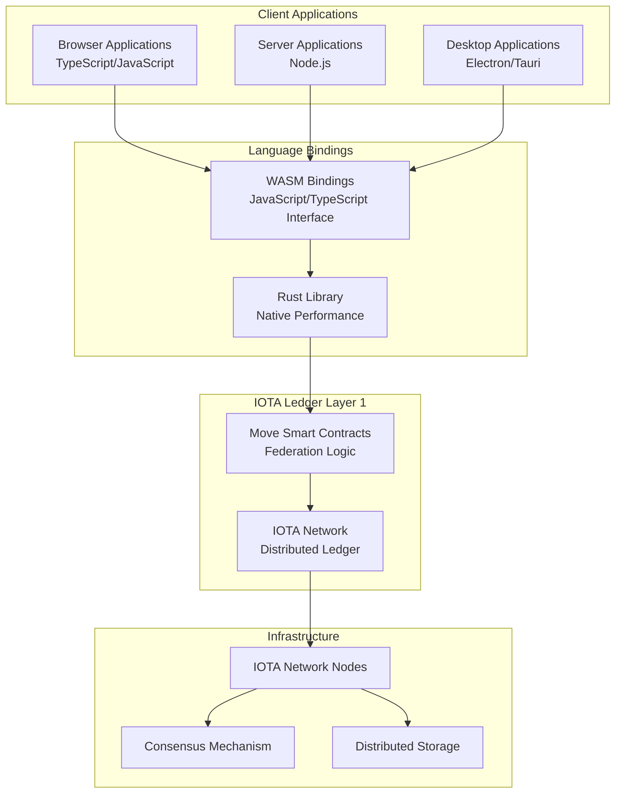

## What is Hierarchies?

### Ideological Perspective

From an ideological standpoint, IOTA Hierarchies represents a fundamental reimagining of how trust and authority should be structured in digital systems. It embodies the principle that **trust is not binary** - it shouldn't be either fully centralized (where one entity controls everything) or completely decentralized (where everyone has equal say regardless of expertise).

:::info
IOTA Hierarchies is an organized delegation of trust
:::

Instead, Hierarchies recognizes that **expertise and responsibility should be distributed according to competence and context**. In the real world, we naturally organize into hierarchies based on knowledge, experience, and specialization. A medical diagnosis carries more weight when made by a licensed physician than by a random individual, not because of arbitrary authority, but because of demonstrated competence and accountability.

### Technological Perspective

From a technological standpoint, IOTA Hierarchies is a set of components aligned into multiple layers, each serving specific purposes in the trust distribution ecosystem:

**Cross-Platform Access - WASM Bindings**: **WebAssembly (WASM) bindings** compile the Rust library to run in browsers and JavaScript environments, enabling **TypeScript and JavaScript** developers to use Hierarchies in web applications, Node.js servers, and other JavaScript runtimes without sacrificing performance or security.

**Integration Layer - Rust Library**: A comprehensive **Rust library** provides high-level abstractions and utilities for interacting with the Move smart contracts. This library handles the complexity of blockchain interactions, transaction construction, and data serialization, making it easy for developers to integrate Hierarchies into Rust applications.

**Core Layer - Move Smart Contracts**: The foundation is implemented in the **Move programming language** - a resource-oriented programming model that provides inherent security guarantees, making it ideal for managing trust relationships and preventing common smart contract vulnerabilities.

**Blockchain Infrastructure - IOTA Network**: The system is deployed on the **IOTA network**, leveraging its scalable and energy-efficient distributed ledger technology. This provides the immutable foundation for trust relationships while ensuring global accessibility and transparency.

