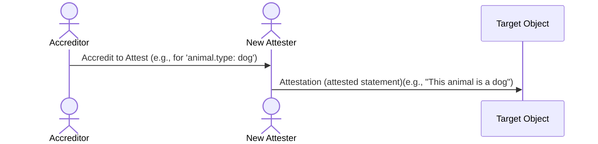
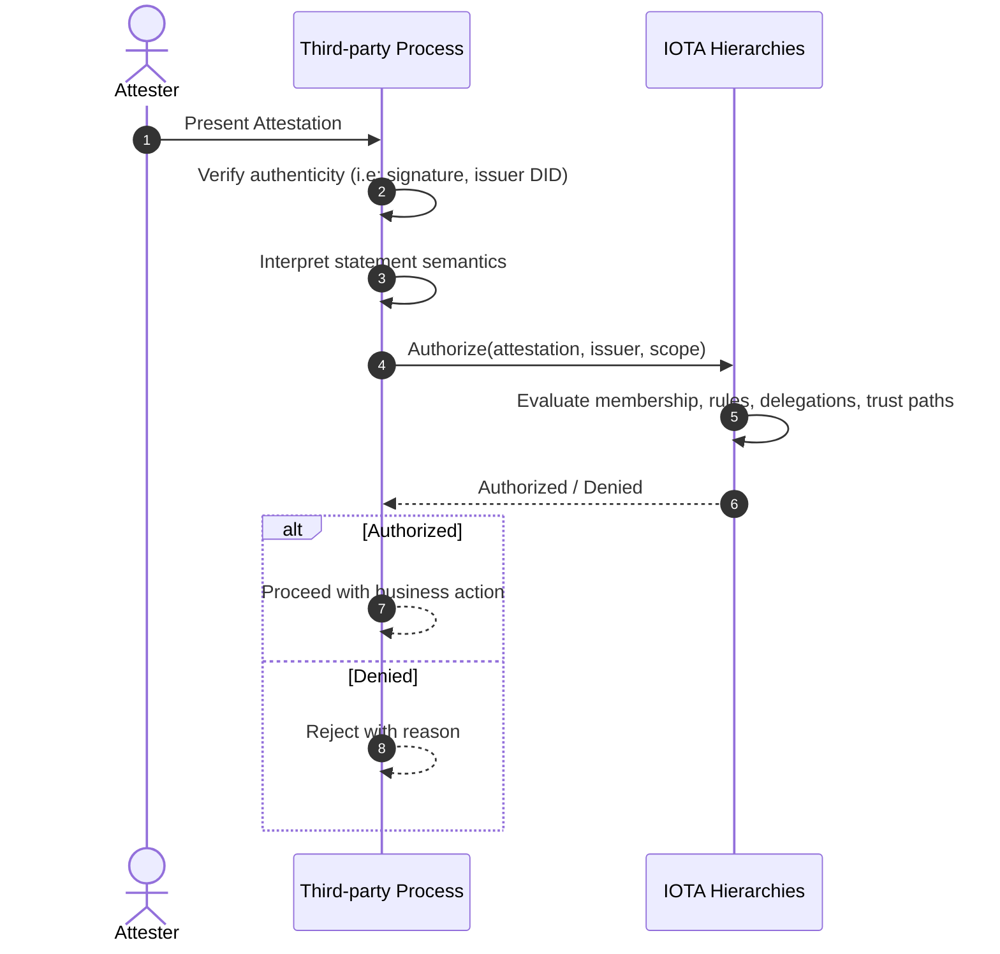
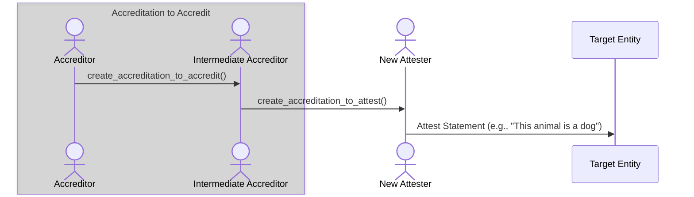

## Accreditation

:::info
Accreditation is a method of delegating abilities within a Federation. The entity that receives the accreditation is called the accreditor.
:::

IOTA Hierarchies supports two types of accreditation:

- Accreditation to Attest
- Accreditation to Accredit.

### Accreditation to Attest

An accredited entity grants another the ability to make [attestations](./terminology.mdx#attestation) using a specific set of [properties](./terminology.mdx#property-and-value), [shape](./terminology.mdx#property-shapes) and values.

:::important
The IOTA Hierarchies do not create attestations (attested statements). Instead, they allow you to verify if someone is authorized to make an attestation. An attestation requires a target object (e.g., "the animal"), which is not within the scope of the Hierarchies. For example, when a scientist says, "This animal is a dog," Hierarchies can verify if the scientist can use the property `animal.type` and value `dog`.  **Attestation exists outside the IOTA Hierarchies system.**
:::

Any object in the IOTA network identified by UID can receive the ability to attest.
To provide the ability to attest you must specify the following:

- The UID of the object that will receive the ability to attest.
- The properties and shape that the object will be able to attest.
- The shape of the properties and values that the object can attest to.

After receiving the ability to attest, the entity can use the properties and values to make attestations.

:::info
 The receiver determines how an attestation is presented. The receiver is also responsible for providing proof of the statement's authenticity. This could include the account's signature or any other method defined by the receiver's process.
:::

Here, we present a typical scenario in which an attestation is submitted to a third-party process. The third-party process is responsible for verifying the statement's authenticity and interpreting its semantics.

### Accreditation to Accredit

An accredited entity grants another the ability to further accredit others (to attest or accredit).

Federation allows for the delegation of abilities to other entities. This is done by accrediting other entities to attest or accredit.
When an entity is accredited to accredit, it can further delegate the ability to attest or accredit. You can delegate the ability to attest or accredit over the entire set of properties and values or a subset of properties and values.

To provide the ability to accredit you must specify the following:

- The UID of the object that will receive the ability to accredit.
- The properties and values that the object will be able to accredit.
- The shape of the properties and values that the object will be able to accredit.

After receiving the ability to accredit, the entity can use the properties and values to accredit other entities.

## Revocation

Revocation is the process of canceling an accreditation. The revocation can be applied to:

- Accreditation to Attest
- Accreditation to Accredit

:::info
Revocation removes an entity's ability to perform new accreditations or attestations under a specific permission but does not invalidate past actions.
:::

The system verifies the revoker's permissions (unless the revoker has root authority). It removes the specified accreditation from the entity's list and emits a revocation event if it is valid.

This revocation is immediate upon transaction execution. Any attestations or sub-accreditations created before the revocation remain valid, as they were issued when the accreditation was active.

This design ensures that revocation affects future capabilities without invalidating historical trust chains.
