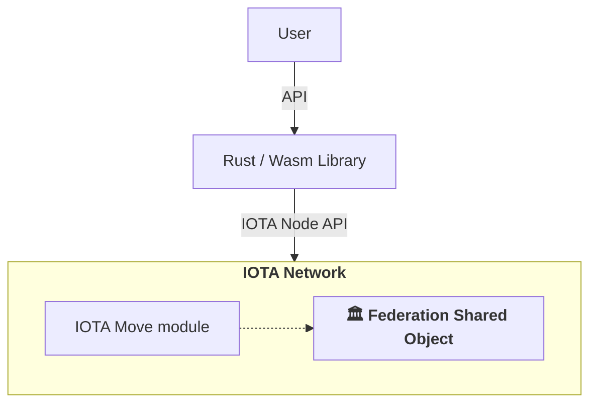

## The Federation: Foundation of Hierarchical Trust

The **Federation** serves as the core governance structure in IOTA Hierarchies, establishing and maintaining hierarchical trust relationships within a specific domain. A Federation functions as a trust distribution framework that enables entities to organize around shared objectives while maintaining defined authority structures.

### Federation

A Federation implements a trust distribution model that differs from both traditional centralized systems (where trust flows from a single point) and fully decentralized systems (where trust is distributed equally). Instead, Federations implement **local centralization** - structured hierarchies within the broader decentralized IOTA ecosystem.
This architecture addresses the requirements for organized decision-making processes while maintaining transparency, immutability, and resilience against single points of failure. Each Federation operates as an autonomous trust domain with its own governance rules.

### What Does a Federation Do?

In Hierarchies, a Federation provides the following governance functions:

- **Manage Trust Distribution**: Control which entities can make authoritative statements about target objects, ensuring that only accredited entities can attest to claims within their designated domain.
- **Enforce Hierarchical Delegation**: Implement delegation patterns where root authorities can empower accreditors, who subsequently authorize attesters, establishing defined chains of responsibility.
- **Validate Credibility**: Provide mechanisms to verify whether a statement is authentic and originates from an entity with legitimate authority to make such claims within the Federation's scope.
- **Maintain accountability**: Enable the withdrawal of trust when entities do not meet their designated responsibilities through transparent delegation chains and revocation mechanisms.

### Federation object

The Federation is implemented as a shared object that can be deployed on the IOTA network as part of the Hierarchies Move module. The Federation object can be accessed in two ways:

- Through the Rust/WASM bindings API: This library provides an off-chain management perspective for the Hierarchies, utilizing an API natively exposed by the IOTA network for the Hierarchies module.
- Directly: This involves a pure smart contract interface, allowing direct interaction between IOTA modules installed on the network.

Each Federation contains the following components:

| Component                      | Description                                                                                              |
|--------------------------------|----------------------------------------------------------------------------------------------------------|
| **Federation Properties**      | A registry of all properties with their shapes that the Federation recognizes as valid within its domain |
| **Root Authorities**           | The foundational entities with ultimate administrative power over the Federation                         |
| **Accreditations to Attest**   | Rights granted to entities allowing them to make verifiable statements                                   |
| **Accreditations to Accredit** | Rights granted to entities allowing them to delegate authority to others                                 |

### The Root Authority

Upon Federation creation, the creator automatically becomes the first **Root Authority**, establishing ownership of the trust domain. This transition from creator to authority establishes the initial governance structure and provides the foundation for all subsequent delegations.

:::info
**Root Authority** possesses ultimate administrative power within its Federation
:::

The primary responsibilities of Root Authority are:

- Define properties and their conditions that are valid within the Federation's domain
- Add additional Root Authorities, distributing administrative power among trusted entities
- Grant accreditations directly without requiring permission from other entities
- Revoke authorities and accreditations as needed

This initial concentration of administrative power enables efficient decision-making and clear accountability during the Federation's establishment phase. As the Federation develops, Root Authorities can add additional authorities and distribute governance responsibilities, creating more resilient and distributed leadership structures.
