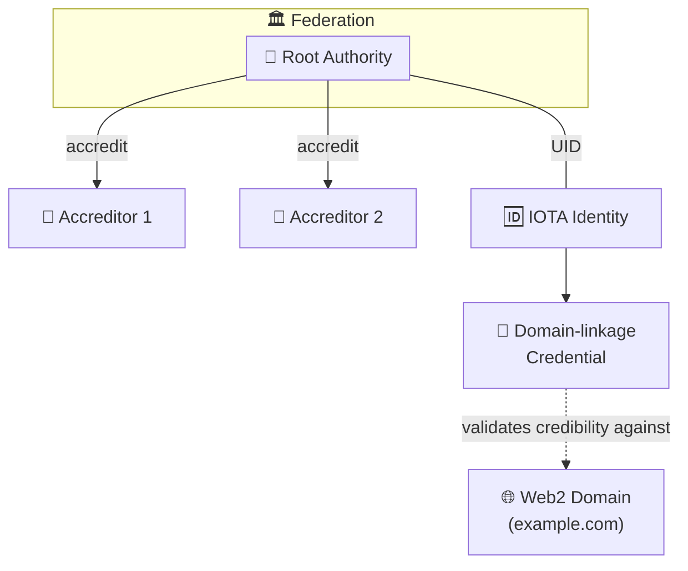
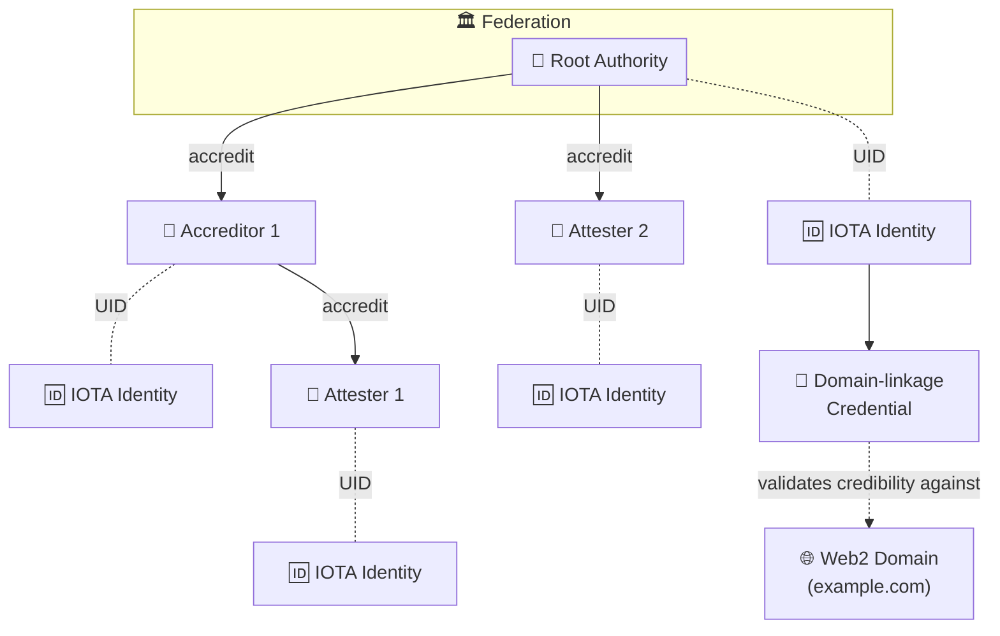
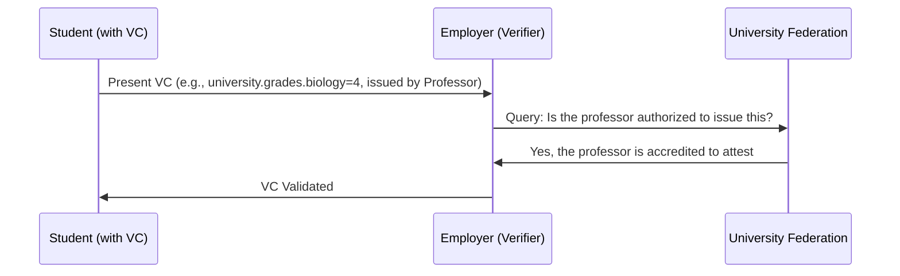

## IOTA Identity and IOTA Hierarchies

At first glance, IOTA Identity (as described in the [IOTA Identity Framework](https://docs.iota.org/developer/iota-identity)) and Hierarchies might seem similar, both dealing with trust and verification.

Here is a comparison of the two:

| Aspect | IOTA Identity | IOTA Hierarchies |
|--------|---------------|------------------|
| **Primary Focus** | Decentralized Identity (DID) and Verifiable Credentials (VCs) | Managing distribution of unopinionated properties through delegations |
| **Core Capability** | Enables control and presentation of verifiable data in standardized way | Focuses on hierarchical rights delegation |
| **Emphasis** | Privacy, security, and interoperability | Specification-agnostic property distribution |
| **Functionality** | Allows entities to prove attributes without revealing unnecessary information | Manages delegation of attestation abilities |
| **Approach** | Standardized presentation of credentials | Unopinionated about credential format or presentation |
| **Use Case** | Identity verification and credential presentation | Authority delegation and trust chain management |

:::info
The main focus of Hierarchies is distribution and management, while Identity is about protocol-level presentation and exchange.
:::

## IOTA Hierarchies & IOTA Identity together

Hierarchies flexible and unopinionated nature allows it to be integrated with IOTA Identity in various ways. Below are three proposed use cases:

- IOTA Identity as Root Authority
- IOTA Identity as Any Federation Member
- IOTA Hierarchies as a Credential Source for IOTA Identity

These are merely suggestions. The system's inherent flexibility means you can adapt and use it in numerous other ways to suit your needs.

### IOTA Identity as Root Authority

Use an IOTA Identity as the Federation's Root Authority for instant credibility (e.g., linked to a Web2 domain via domain linkage credentials).

In this scenario, the Root Authority is represented by an IOTA Identity. The Federation uses the UID from the IOTA network to identify its members, without considering any other attributes of the UID owner. Conversely, the IOTA Identity linked to the UID includes domain linkage credentials, which verify ownership of the domain example.com. The other members of the Federation are not IOTA Identities; instead, they are accounts accredited by the Root Authority.

### IOTA Identity as Any Federation Member

Every entity within the hierarchy can be represented as an IOTA Identity, enhancing the system's overall credibility. If the Federation aims for the highest level of credibility, each member can be assigned an IOTA Identity. In this setup, both the Root Authority and the Federation members are represented as IOTA Identities. The Federation also recognizes Accreditors and Attesters as IOTA Objects with unique identifiers (UIDs), allowing their IOTA Identities' UIDs to be used for receiving accreditation to attest or further accredit.

### IOTA Identity as Any Federation Member

Every entity within the hierarchy can be represented as an IOTA Identity, enhancing the overall credibility of the system. If the Federation aims for the highest level of credibility, each member can be assigned an IOTA Identity. In this setup, both the Root Authority and the Federation members are represented as IOTA Identities. Accreditors and Attesters are also recognized by the Federation as IOTA Objects with unique identifiers (UIDs), allowing their IOTA Identities' UIDs to be used for receiving accreditation to attest or further accredit.

### IOTA Hierarchies as Credential Source for IOTA Identity

An interesting scenario arises when IOTA Hierarchies is integrated into the validation process for Iota Identity and Credentials. Consider a student who possesses a Credential containing their grades. The student wishes to present this credential to a potential employer. Upon reviewing the credentials, the employer sees the professor's signature and the assigned grade. To verify whether the professor is authorized to issue such a statement about the student's grade, the employer consults the Federation.

