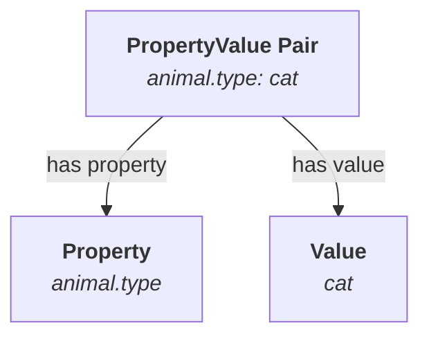
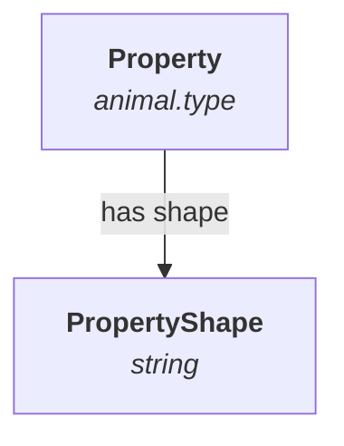
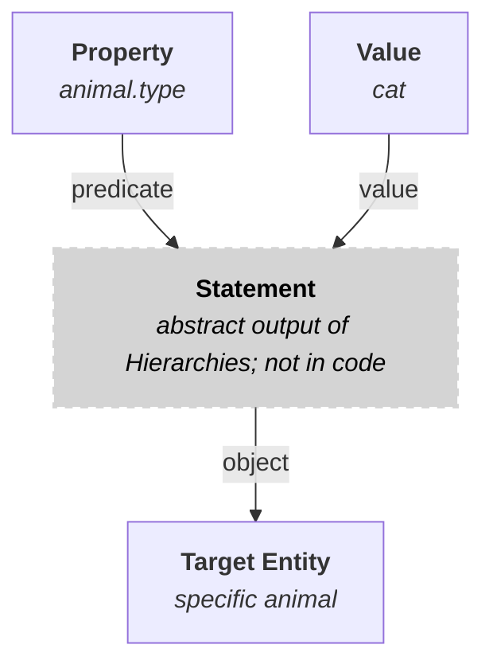
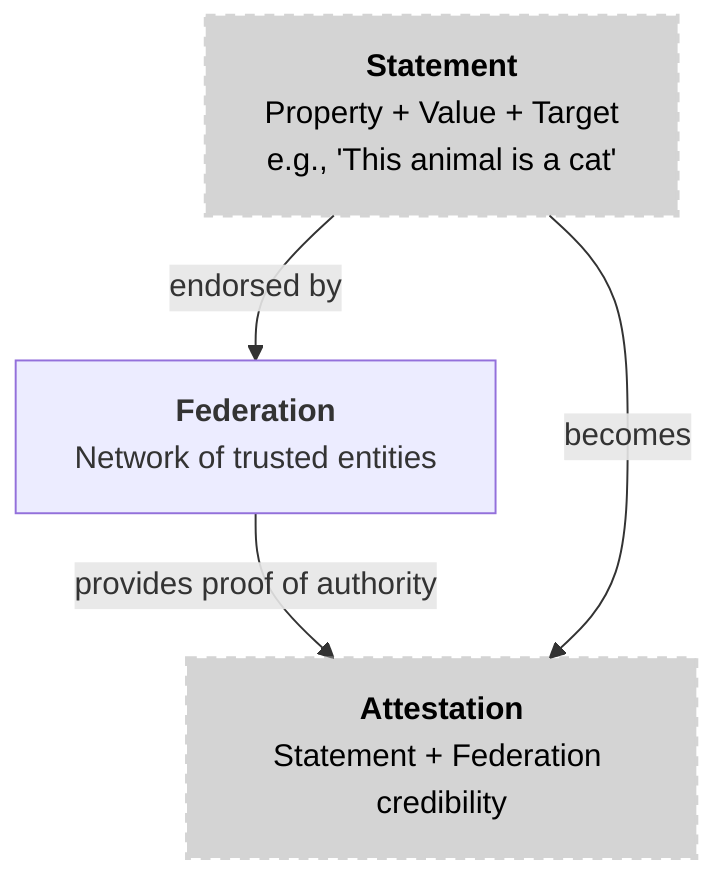

## Property and Value

When defining the ontology, we took inspiration from knowledge theory. In knowledge theory, a property is a predicate used to describe an entity's attributes and relationships. Property has an associated value, which is a subject that describes the property. When property and value are combined, they form a property-value pair.
In Hierarchies, we use the same concept. A property is a predicate that describes the entity's attributes and relationships. Property has an associated value, which is a subject that describes the property. Property and value exist next to each other and are combined to form a property-value pair.

The example of a property and value is:

- Property: `animal.type`
- Value: `cat`

## Property Value Pair

A property-value pair is a combination of a property and a value. It describes an entity's attributes and relationships.

The example of a property value pair is:

- Property: `animal.type`
- Value: `cat`
- Property Value Pair: `animal.type:  cat`

The following diagram illustrates how a property value pair is composed of a property and a value:

## Property Shapes

To ensure that all statements within IOTA Hierarchies are both valid and meaningful, every property is associated with a **shape**. A shape is a set of rules, or constraints, that dictate the acceptable values a property can hold. This mechanism acts as a contract, guaranteeing data integrity and enhancing the reliability of statements made within the system. By defining a clear shape, you can prevent invalid data from being associated with a property, such as assigning a text value to a property that should be numeric.

### Numeric Constraints

For properties that expect a numerical value, the following constraints can be applied to enforce specific conditions:

- **Equal**: Requires the property's value to be an exact match to a specified number.
- **Greater Than**: Ensures the property's value is numerically greater than a specified threshold.
- **Lower Than**: Ensures the property's value is numerically less than a specified threshold.
- **One Of**: Restricts the property's value to a selection from a predefined list of numbers.
- **Any**: Allows any numerical value, providing flexibility while still enforcing the correct data type.

### String Constraints

For properties that expect a text-based value, a rich set of string-specific constraints is available:

- **Equal**: Requires the property's value to be an exact string match (case-sensitive).
- **Starts With**: Enforces that the property's value must begin with a specific substring.
- **Ends With**: Enforces the property's value to end with a specific substring.
- **Contains**: Ensures the property's value includes a specific substring anywhere.
- **One Of**: Restricts the property's value to a selection from a predefined list of strings.
- **Any**: Allows any string value, which is useful for general-purpose text properties where the format is not critical.

### Temporal Constraints

Beyond numbers and strings, IOTA Hierarchies also support temporal constraints. This allows you to define shapes for time-related properties, such as timestamps or durations, ensuring that time-sensitive data remains valid and consistent.

By leveraging property shapes, developers can build robust and trustworthy systems where data conforms to expected standards, reducing errors and increasing overall system reliability.

The following diagram illustrates how a property shape is composed of a property and a shape:

- Property: `animal.type`
- Shape: `string`
- Property Shape: `animal.type: string`

## Statement

A statement links a property and its value to a **target object** - the specific entity the claim describes. The target object is the receiver of the property-value pair and the described thing.

An example of a statement is:

- **Property**: `animal.type`
- **Value**: `cat`
- **Target Object**: `A specific animal`
- **Statement**: `A specific animal is a cat`

The target object anchors the property-value pair to a specific entity, giving it context. Without a target object, a pair like `animal.type = cat` is an abstract fact. The target object answers the question: *"What is a cat?"* by pointing to a specific subject.

The following diagram illustrates how these components form a complete statement:

## Attestation

Building on the foundation of statements, an **attestation** represents a verified claim made about an entity by an accredited authority. While a statement is a basic assertion combining a property-value pair with a target object, an attestation elevates this by incorporating credibility and validation mechanisms provided by the Federation and Hierarchies module.

In essence, an attestation is a statement that a trusted, accredited entity has endorsed. This endorsement adds a layer of trustworthiness, as the attestation can be validated within the Hierarchies system. The Federation - a network of accredited entities - ensures that only authorized parties can issue such attestations, thereby preventing fraudulent or unauthorized claims.

### Why Attestations Matter

Attestations are crucial in decentralized systems like IOTA Hierarchies because they provide a mechanism for establishing trust without relying on a central authority. For example, in a supply chain scenario, an attestation could verify that a product meets certain quality standards, issued by an accredited inspector. The validity of this attestation depends on:

- **Credibility of the Accredited Entity**: The issuer must be recognized and trusted within the Federation.
- **Federation's Validation**: The Hierarchies module allows for checking the attestation against the Federation's rules and records.

This process ensures that attestations are not just statements but reliable, verifiable truths that can be used in various applications, from identity verification to asset tracking.

The following diagram illustrates the relationship between a statement and attestations:

