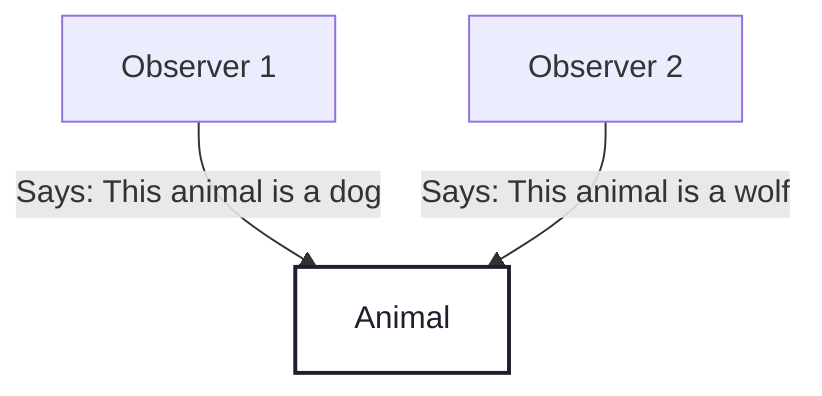
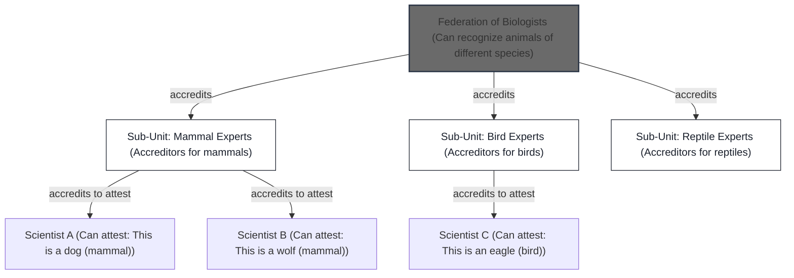

# Hierarchies

## Introduction

In the age of information, where data is generated at an unprecedented scale, our primary challenge isn't accessing information but verifying its credibility and trustworthiness. With the rise of artificial intelligence, vast amounts of content can be created instantly, flooding our digital landscapes with facts, opinions, and fabrications. This abundance erodes traditional methods of judgment, where "more information" once equated to "more likely correct." Instead, we face a crisis of trust: how do we distinguish reliable knowledge from noise?

Consider the overwhelming volume of data we encounter daily-social media posts, news articles, scientific claims, and AI-generated content. Without mechanisms to assess credibility, misinformation spreads rapidly, leading to real-world consequences like eroded public trust in institutions, flawed decision-making, and societal divisions. The core issue is not just the information itself but how trust is established and distributed. Who gets to decide what's true, and how can we ensure that decision is reliable? This is where concepts like IOTA Hierarchies come into play, providing a structured way to delegate and verify trust in a decentralized manner.

Hierarchies builds on the principles of decentralized systems, allowing entities to form federations where trust is distributed hierarchically. It addresses the limitations of simple observations or majority votes by enabling "experts" to make verifiable statements with high confidence. By doing so, it creates a framework for credible attributions in large, complex systems - much like how societies organize through delegations of authority.

## The Problem of Trust and Its Distribution

Let's illustrate the challenge with a simple scenario: Imagine an animal in the wild, observed by two people. One observer says, "This animal is a dog" while the other insists, "This animal is a wolf." From an epistemological standpoint (the study of knowledge), both are making judgments about the subject - the animal - but neither provides certainty. These are mere predicates without backing evidence or authority.

The issue here is certainty. We don't know whose judgment is accurate, and both carry a low level of belief. They guarantee nothing beyond personal opinion. To resolve this, we could:

- **Gather more observers and choose the most popular judgment**: This seems democratic but doesn't ensure accuracy. A majority might still be wrong if specialized knowledge is required (e.g., distinguishing subtle species differences).
- **Find a specialist to make an authoritative statement**: A qualified expert, like a biologist, can assert with high confidence, "This animal is a wolf," turning a mere predicate into a trusted statement equipped with evidence and authority.

The second approach is more reliable because it relies on expertise. However, it raises a new question: How do we identify and trust these specialists? Who verifies their competence? This is the essence of trust distribution - ensuring that only qualified entities can make credible claims. IOTA Hierarchies addresses this by creating federations of experts where abilities to attest (make statements) or accredit (delegate abilities) are distributed in a verifiable, hierarchical way.

Ultimately, IOTA Hierarchies isn't just about assigning attributes (like labeling an animal as a "wolf"); it's about managing the distribution of these attributes in systems with complex dependencies and delegations. This is crucial in large-scale environments where traceability of authority is essential, preventing unauthorized claims and ensuring accountability.

Now, let's extend this to a real-world example: a Federation of Biologists. This group unites experts in biology but recognizes that not all are qualified for every task -some specialize in mammals, others in birds. Through IOTA Hierarchies, the federation can distribute trust based on expertise areas.

**Federation of Biologists**: This top-level entity recognizes animals of various species. It divides into sub-units (accreditors) specialized in different animal types. These sub-units can accredit leaf-level entities (e.g., individual scientists) to attest about specific animals. For instance, a mammal specialist can only attest to mammal-related statements.

This hierarchical structure ensures trust flows logically: The federation delegates to specialists, who further delegate to attuned experts, creating a "hierarchy of rights" that is transparent and revocable.

### Trust Distribution in Everyday Life

Trust distribution isn't abstract - it's woven into human civilization. We rely on delegations of duties to build complex systems that small groups couldn't achieve alone. Hierarchies and organizations are hallmarks of human society, enabling evolution and innovation. Let's explore this narratively through examples:

- **Companies**: In a corporation, a CEO delegates financial decisions to a CFO, who accredits department heads to approve budgets. This hierarchy ensures accountability - much like IOTA Hierarchies, where revoking accreditation prevents misuse.

- **Universities**: A university president (root authority) accredits deans to manage faculties, who then accredit professors to grade students. Statements like "Student X earned an A in Biology" carry weight because of this delegated trust.

- **Government Institutions**: Laws are enacted by parliaments, delegated to agencies for enforcement, and further to local officers. Hierarchies ensure checks and balances, with revocation mechanisms to prevent abuse.

- **Supply Chains**: A manufacturer accredits suppliers to certify product quality. If a supplier fails, accreditation is revoked, maintaining chain integrity.

- **Medicine**: Hospitals accredit doctors to perform procedures, based on credentials from medical boards.

- **Households and Home Automation**: Even in smart homes, an AI assistant might be accredited by the homeowner to control devices, delegating tasks like adjusting lights based on occupancy - foreshadowing a future where AI takes over responsibilities with verifiable trust.

In all these cases, IOTA Hierarchies provides a digital analog: a tamper-proof way to manage delegations, ensuring trust scales without central points of failure.
