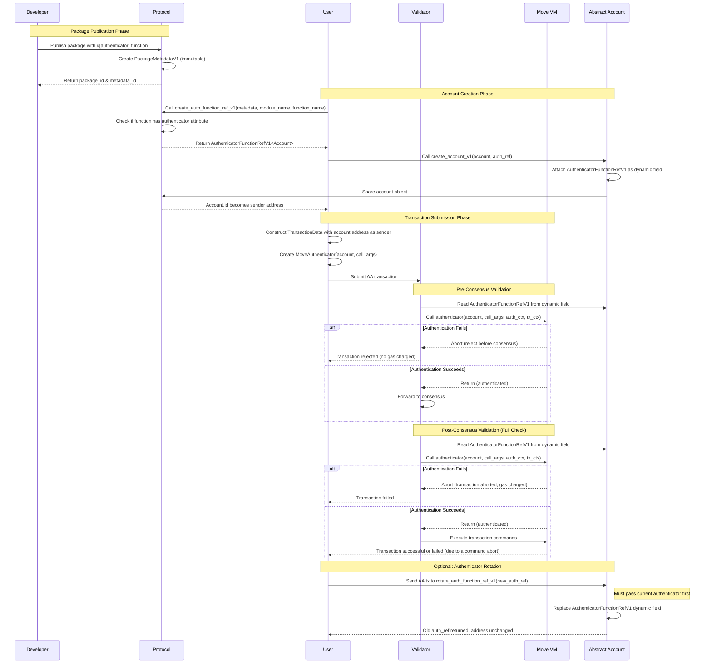

```mermaid
flowchart TD
    Start([Developer Starts]) --> Publish["Publish Move Package<br/>with #[authenticator] function"]

    Publish --> MetadataCreated[Protocol creates<br/>PackageMetadataV1<br/>immutable object]

    MetadataCreated --> UserPhase([User Creates Account])
    UserPhase --> CreateAuthRef[Call create_auth_function_ref_v1<br/>metadata, module_name, function_name]

    CreateAuthRef --> ValidateAuth{Check if function<br/>has authenticator<br/>attribute?}

    ValidateAuth -->|Invalid| Error1[Abort:<br/>Invalid authenticator]
    ValidateAuth -->|Valid| AuthRefCreated[AuthenticatorFunctionRefV1<br/>created]

    AuthRefCreated --> BuildAccount[Build Account Object<br/>IOTAccountBuilder pattern]

    BuildAccount --> AttachFields[Attach dynamic fields:<br/>- Public keys<br/>- Admin address<br/>- Time locks<br/>- Spending limits<br/>- Member lists]

    AttachFields --> CreateAccount[Call create_account_v1<br/>account, authenticator]

    CreateAccount --> AttachAuthRef[Attach AuthenticatorFunctionRefV1<br/>as dynamic field on account]

    AttachAuthRef --> ShareAccount[Share account object<br/>account.id = sender address]

    ShareAccount --> AccountReady[Account Ready<br/>Can receive transactions]

    AccountReady --> UserSubmit[User constructs AA transaction<br/>sender = account address]

    UserSubmit --> CreateMoveAuth[Create MoveAuthenticator:<br/>- account<br/>- call_args<br/>- type_arguments]

    CreateMoveAuth --> SubmitTx[Submit transaction to validator]

    SubmitTx --> PreConsensus{Pre-Consensus<br/>Validation<br/>Optimistic Check}

    PreConsensus --> ReadAuthRef1[Read AuthenticatorFunctionRefV1<br/>from account dynamic field]

    ReadAuthRef1 --> CallAuth1[Call authenticator function:<br/>account, call_args, auth_ctx, tx_ctx]

    CallAuth1 --> AuthCheck1{Authenticator<br/>returns or<br/>aborts?}

    AuthCheck1 -->|Abort| Reject1[Reject transaction<br/>NO gas charged<br/>before consensus]
    AuthCheck1 -->|Return| ToConsensus[Forward to consensus]

    ToConsensus --> Consensus[Consensus reached]

    Consensus --> PostConsensus{Post-Consensus<br/>Validation<br/>Full Check}

    PostConsensus --> ReadAuthRef2[Read AuthenticatorFunctionRefV1<br/>from account dynamic field]

    ReadAuthRef2 --> CallAuth2[Call authenticator function:<br/>account, call_args, auth_ctx, tx_ctx]

    CallAuth2 --> AuthCheck2{Authenticator<br/>returns or<br/>aborts?}

    AuthCheck2 -->|Abort| Reject2[Transaction aborted<br/>Gas charged]
    AuthCheck2 -->|Return| Execute[Execute transaction commands]

    Execute --> Success[Transaction successful <br/>or<br/> failed due to a command abort]

    Success --> NextAction{Need to update<br/>authenticator?}

    NextAction -->|Yes| RotateAuth[Send AA tx:<br/>rotate_auth_function_ref_v1]
    NextAction -->|No| End([End])

    RotateAuth --> MustPassCurrent[Must pass current<br/>authenticator first]

    MustPassCurrent --> RotateAuthRef[Replace AuthenticatorFunctionRefV1<br/>dynamic field]

    RotateAuthRef --> AddressUnchanged[Account address unchanged<br/>Old auth_ref returned]

    AddressUnchanged --> End

    Reject1 --> End
    Reject2 --> End
    Error1 --> End
```

# Account Abstraction

## Summary

Account Abstraction in IOTA replaces fixed cryptographic signature verification with a programmable Move function. An abstract account is a Move object whose ObjectID is its address; its authenticator function is registered on-chain via [`AuthenticatorFunctionRefV1`](../../../references/framework/iota/authenticator_function.mdx#iota_authenticator_function_AuthenticatorFunctionRefV1) and called by the protocol on every incoming AA transaction. The AA transaction sender provides a `MoveAuthenticator` instead of a traditional signature, supplying the arguments the authenticator function needs. The authenticator function receives the account, those arguments, an [`AuthContext`](../../../references/framework/iota/auth_context.mdx#iota_auth_context_AuthContext) describing the AA transaction, and a [`TxContext`](../../../references/framework/iota/tx_context.mdx#iota_tx_context_TxContext), and it either returns (authenticated) or aborts (rejected).

## What Is Account Abstraction?

Traditional IOTA accounts, known as Externally Owned Accounts (EOAs), are controlled by a single cryptographic key pair. Every transaction sent from an EOA must be signed with the corresponding private key; the protocol verifies the signature before allowing the transaction to proceed. This model is simple but rigid: authentication is always reduced to possession of a private key.

**Account Abstraction (AA)** replaces this fixed rule with programmable logic.

Instead of forcing the authentication of an account to the checking of a cryptographic signature, the protocol calls a Move function _you_ define. That function decides whether the transaction is authorized. If the function executes successfully, the transaction proceeds; if the function aborts, the transaction is rejected.

For the full technical specification, including component details, protocol design, requirements, and test cases, see [IIP-0009](https://github.com/iotaledger/IIPs/blob/main/iips/IIP-0009/IIP-0009.md).

## Why Account Abstraction?

AA accounts offer two main properties that EOAs cannot provide:

- **Stable address** — the account address is an `ObjectID`, not derived from a key pair. The address never changes, even when keys are rotated or the authentication scheme is replaced entirely.
- **Programmable authentication** — any Move function (following the [authenticator function requirements](./components.mdx#authenticator-function)) can serve as the authenticator.

Together, these enable use cases like:

- Key rotation and recovery without address change
- Dynamic multisig with on-chain member management
- DAO governance and treasury access control
- Function-call keys that restrict which Move functions an account can call
- Spending limits and time locks
- Any custom cryptographic scheme not natively supported by IOTA

## The Authentication Lifecycle

The following diagrams illustrate how the components interact from package publication through transaction execution:

<Tabs groupId="diagram" queryString>
<TabItem value="Sequence Diagram" label="Sequence Diagram">

</TabItem>

<TabItem value="Flowchart" label="Flowchart">

</TabItem>

</Tabs>

For the full technical specification, including component details, protocol design, requirements, and test cases, see [IIP-0009](https://github.com/iotaledger/IIPs/blob/main/iips/IIP-0009/IIP-0009.md).
