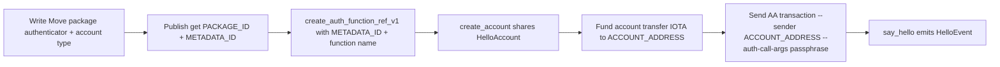

import AccountAbstraction from '../../../_snippets/developer/move/aa.mdx';

<AccountAbstraction />

## Introduction

In this tutorial you will build a minimal abstract account

By the end you will have:

- Written a Move package containing an **authenticator function** and an **abstract account** type.
- Published the package.
- Created an `AuthenticatorFunctionRefV1` that links your authenticator function to your account type.
- Created and shared a `HelloAccount` object whose `ObjectID` becomes its on-chain address.
- Sent an AA transaction **from** that account.

You will also understand why **sender checks** are essential in any function that mutates an abstract account.

### Key Concepts Covered

1. [**Authenticator function**](../../move/explanations/account-abstraction/components.mdx#authenticator-function): a `#[authenticator]`-annotated Move function that replaces cryptographic signature verification.
2. [**`AuthenticatorFunctionRefV1`**](../../move/explanations/account-abstraction/components.mdx#authenticatorfunctionrefv1): the on-chain, validated reference that binds an authenticator to your account type.
3. [**Abstract account creation**](../../move/how-tos/account-abstraction/create-manage/create-iotaccount.mdx): how `iota::account::create_account_v1` validates the ref and shares the account.
4. **`MoveAuthenticator`**: the transaction signature variant that carries authentication arguments to your authenticator instead of a private-key signature.
5. **Sender checks**: why every function that mutates an account must verify `ctx.sender() == account.id.uid_to_address()`.

## Architecture Overview

For a full visual overview of how the components interact from package publication through transaction execution, see the [Account Abstraction introduction](../../move/explanations/account-abstraction/introduction.mdx#the-authentication-lifecycle).

## Prerequisites

- [IOTA CLI installed](../../getting-started/install-iota.mdx)
- Familiarity with Move and account abstraction concepts (see [Account Abstraction introduction](../../move/explanations/account-abstraction/introduction.mdx))

## 1. Set Up Your Network Environment

<Tabs groupId="network" queryString>
<TabItem value="devnet" label="Devnet">

Configure the CLI to use devnet and fund your address from the public faucet:

```bash
# Switch to devnet
iota client switch --env devnet
```

</TabItem>
<TabItem value="testnet" label="Testnet">

Configure the CLI to use testnet and fund your address from the public faucet:

```bash
# Switch to testnet
iota client switch --env testnet
```

</TabItem>
<TabItem value="localnet" label="Local Network">

Start a local IOTA network with a built-in faucet (run this in a separate terminal and keep it running):

```bash
RUST_LOG="off,iota_node=info" iota start --force-regenesis --with-faucet
```

:::tip Full local network setup guide

For more details on starting and configuring a local network, see [Start a Local Network](../../getting-started/local-network.mdx).

:::

Once the network is up, configure the CLI to point at it and fund your address with test tokens:

```bash
# Switch to localnet
iota client switch --env localnet
```

</TabItem>
</Tabs>

```bash
# Confirm your active address
iota client active-address

# Request test tokens from the faucet
iota client faucet --url http://127.0.0.1:9123/gas
```

Verify the faucet credited your account:

```bash
iota client balance
```

You should see a non-zero IOTA balance before proceeding.

:::note Using an existing wallet address (recommended)
If you already have an address in the IOTA Wallet browser extension, you can export its private key and import it into the CLI so you use the same address throughout this tutorial:

```bash
iota keytool import "iotaprivkey<YOUR_EXPORTED_KEY>" ed25519 --alias "my-wallet"
iota client switch --address my-wallet
```

This is the recommended approach when you want to inspect results in the wallet UI while following a CLI tutorial. You can export a private key from **IOTA Wallet → Manage Accounts → Export Private Key**.
:::

## 2. Create the Move Package

Create a new Move package named `hello_auth`:

```bash
iota move new hello_auth
cd hello_auth
```

Open `sources/hello_auth.move` and replace the generated placeholder with the following code:

```move
module hello_auth::hello_auth;

use iota::account;
use iota::auth_context::AuthContext;
use iota::authenticator_function::AuthenticatorFunctionRefV1;
use iota::event;

// === Error Constants ===

/// Aborts when a function that modifies the account is called by a non-account sender.
#[error(code = 0)]
const ENotTheAccount: vector<u8> = b"Only the account itself can invoke this function.";

// === Structs ===

/// The abstract account type. Its ObjectID becomes the account's on-chain address.
public struct HelloAccount has key {
    id: UID,
}

/// Event emitted when the account says hello.
public struct HelloEvent has copy, drop {
    sender: address,
    message: std::ascii::String,
}

// === Account Setup ===

/// Creates a new HelloAccount and shares it on-chain.
///
/// Call this in a PTB immediately after creating an
/// `AuthenticatorFunctionRefV1` for your authenticator.
public fun create_account(
    auth_ref: AuthenticatorFunctionRefV1<HelloAccount>,
    ctx: &mut TxContext,
) {
    let account = HelloAccount { id: object::new(ctx) };
    // Validates `auth_ref` against the `HelloAccount` type and shares the object.
    // The account's ObjectID becomes the sender address for all future AA transactions.
    account::create_account_v1(account, auth_ref);
}

// === Account Actions ===

/// Emits a HelloEvent from the account address.
///
/// Authentication has already run before this function is called,
/// so `ctx.sender()` is guaranteed to equal the abstract account's address.
/// No sender check is needed here because this function does not mutate the account.
public fun say_hello(
    message: std::ascii::String,
    ctx: &TxContext,
) {
    event::emit(HelloEvent {
        sender: ctx.sender(),
        message,
    });
}

/// Rotates the authenticator function reference.
///
/// This function mutates the account, so it MUST verify that the caller
/// is the account itself. Without this check, any user could point the
/// account at a malicious authenticator and take control of it.
public fun rotate_authenticator(
    account: &mut HelloAccount,
    new_auth_ref: AuthenticatorFunctionRefV1<HelloAccount>,
    ctx: &TxContext,
): AuthenticatorFunctionRefV1<HelloAccount> {
    // Sender check: reject calls that do not originate from an AA transaction
    // authenticated as this specific account.
    assert!(account.id.uid_to_address() == ctx.sender(), ENotTheAccount);
    account::rotate_auth_function_ref_v1(account, new_auth_ref)
}

// === Authenticator ===

/// The authenticator function for HelloAccount.
///
/// Signature requirements (enforced by the Move bytecode verifier):
///   1. Public, non-entry.
///   2. First parameter: &HelloAccount (the account being authenticated).
///   3. Middle parameters: read-only inputs (the passphrase here).
///   4. Second-to-last: &AuthContext (describes the incoming AA transaction).
///   5. Last: &TxContext (standard transaction context).
///   6. No return type returning means "authenticated"; aborting means "rejected".
#[authenticator]
public fun authenticate_hello(
    _account: &HelloAccount,
    passphrase: std::ascii::String,
    _auth_ctx: &AuthContext,
    _ctx: &TxContext,
) {
    // Accept only the passphrase "hello".
    // In a real account, replace this with cryptographic signature verification.
    // See: Authenticate an Account with a Public Key (link at the end of this tutorial).
    assert!(passphrase == std::ascii::string(b"hello"), 0);
}
```

### What each part does

| Component | Role |
| --- | --- |
| `HelloAccount` | The abstract account struct. Its `id.to_address()` is the account's on-chain address. |
| `create_account` | Creates and shares the account, binding it to the given authenticator reference. |
| `say_hello` | An action the account performs. Emits an event with the sender address. |
| `rotate_authenticator` | A mutable account operation **requires a sender check**. |
| `authenticate_hello` | The `#[authenticator]` function. Accepts only the passphrase `"hello"`. |

## 3. Build and Publish the Package

Build the package to check for errors:

```bash
iota move build
```

If the build succeeds, publish to the network and capture the output as JSON:

```bash
iota client publish --json
```

From the JSON output, locate two values:

- **`PACKAGE_ID`** the published package ID. Find the `object_changes` entry with `"type": "published"` and copy its `"packageId"`.
- **`METADATA_ID`** the `PackageMetadataV1` object ID. Find the entry whose `"objectType"` ends with `::package_metadata::PackageMetadataV1` and copy its `"objectId"`.

:::tip Finding PackageMetadataV1 in the output
The `PackageMetadataV1` object is created automatically by the protocol when you publish a package. It is an **immutable** object that records every module and every function in your package including whether a function has the `#[authenticator]` attribute. The protocol uses this as a trusted source when you call `create_auth_function_ref_v1`.
:::

Export both values for use in later steps:

```bash
export PACKAGE_ID=0x<YOUR_PACKAGE_ID>
export METADATA_ID=0x<YOUR_METADATA_ID>
```

Verify the metadata object is on-chain:

```bash
iota client object $METADATA_ID
```

## 4. Create the `AuthenticatorFunctionRefV1` and Your Account

An `AuthenticatorFunctionRefV1<HelloAccount>` is the on-chain proof that `authenticate_hello` is a valid authenticator for `HelloAccount`. You create it by calling `iota::authenticator_function::create_auth_function_ref_v1` with:

- A **type argument** binding it to `HelloAccount`.
- Your **`PackageMetadataV1`** object (passed by immutable reference with the `@` prefix).
- The **module name** and **function name** of your authenticator function.

The following PTB creates the `AuthenticatorFunctionRefV1` and passes it directly to `create_account`, sharing your new `HelloAccount` in a single transaction:

```bash
iota client ptb \
  --move-call iota::authenticator_function::create_auth_function_ref_v1 \
      "<${PACKAGE_ID}::hello_auth::HelloAccount>" \
      @$METADATA_ID \
      '"hello_auth"' \
      '"authenticate_hello"' \
  --assign auth_ref \
  --move-call ${PACKAGE_ID}::hello_auth::create_account \
      auth_ref \
  --gas-budget 10000000
```

**What this PTB does, step by step:**

1. **`create_auth_function_ref_v1`** is called with:
   - `<${PACKAGE_ID}::hello_auth::HelloAccount>` the type parameter that binds the ref to your account type. This prevents attaching a multisig authenticator to a `HelloAccount`, for example.
   - `@$METADATA_ID` the immutable `PackageMetadataV1` object. The `@` prefix tells the CLI to resolve it as an object reference.
   - `'"hello_auth"'` the module name (an `ascii::String`).
   - `'"authenticate_hello"'` the function name. The protocol verifies this function carries the `#[authenticator]` attribute and has the correct signature.
2. **`--assign auth_ref`** binds the returned `AuthenticatorFunctionRefV1<HelloAccount>` to the variable `auth_ref` so it can be used in the next command.
3. **`create_account`** receives `auth_ref`, calls `iota::account::create_account_v1` internally, which:
   - Validates that `auth_ref` is compatible with `HelloAccount`.
   - Attaches `auth_ref` as a dynamic field on the account.
   - Shares the account as a mutable shared object.
   - Emits a `MutableAccountCreated` event.

## 5. Identify Your Account Address

After the transaction in step 4 completes, a new `HelloAccount` shared object exists on-chain. Its `ObjectID` is your account's address.

The easiest way to find it is from the **`MutableAccountCreated` event** printed in the transaction output look for the `account_id` field:

```
│ account_id │ 0x<YOUR_HELLO_ACCOUNT_OBJECT_ID> │
```

Alternatively, find it in the **Object Changes** section: look for the entry with `Owner: Shared` and `ObjectType` ending in `::hello_auth::HelloAccount`.

:::warning Do not confuse PACKAGE_ID with ACCOUNT_ADDRESS
Both are hex addresses, but they are different objects. `PACKAGE_ID` is the published package (immutable), while `ACCOUNT_ADDRESS` is the `HelloAccount` shared object. Use the `account_id` from the `MutableAccountCreated` event to be sure.
:::

```bash
export ACCOUNT_ADDRESS=0x<YOUR_HELLO_ACCOUNT_OBJECT_ID>
```

Inspect the object to confirm it is shared:

```bash
iota client object $ACCOUNT_ADDRESS
```

The output should show `Owner: Shared` and `objType: ..::hello_auth::HelloAccount`.

:::note Your account address is stable
Unlike an EOA whose address is derived from a key pair, `$ACCOUNT_ADDRESS` is the `ObjectID` of the `HelloAccount` object. This address never changes, even if you later rotate the authenticator function.
:::

## 6. Fund the Account

AA transactions pay gas from the sender's owned coins. Since `$ACCOUNT_ADDRESS` is the sender, you must transfer some IOTA to it before sending transactions from it.

```bash
iota client ptb \
  --split-coins gas "[1000000000]" \
  --assign coin \
  --transfer-objects "[coin]" @$ACCOUNT_ADDRESS \
  --gas-budget 10000000
```

Verify the balance:

```bash
iota client balance $ACCOUNT_ADDRESS
```

## 7. Send an AA Transaction

An AA transaction is **submitted by your address** but executes *on behalf of* the abstract account. You do not switch to the abstract account address — instead, you stay on your address and declare the abstract account as the sender via `--sender @$ACCOUNT_ADDRESS`. The address key signs the outer transaction envelope; `--auth-call-args` supplies the Move-level authentication that the validator uses to authorize the abstract account.

Send the transaction:

```bash
iota client ptb \
  --sender @$ACCOUNT_ADDRESS \
  --move-call ${PACKAGE_ID}::hello_auth::say_hello '"Hello from my abstract account!"' \
  --auth-call-args "hello" \
  --gas-budget 10000000
```

**What happens under the hood:**

1. The CLI builds a `MoveAuthenticator` for the abstract account:
   - `object_to_authenticate`: the `HelloAccount` shared object (`$ACCOUNT_ADDRESS`).
   - `call_args`: the string `hello` from `--auth-call-args`.
2. The validator reads the `AuthenticatorFunctionRefV1` dynamic field from the account and calls `authenticate_hello(account, "hello", auth_ctx, tx_ctx)`.
3. `authenticate_hello` asserts `passphrase == "hello"` — the assertion passes and authentication succeeds.
4. The PTB command `say_hello("Hello from my abstract account!")` executes and emits a `HelloEvent` on-chain.

You can verify the event was emitted by inspecting the transaction effects:

```bash
iota client tx-block <TRANSACTION_DIGEST>
```

### What happens when authentication fails

If you supply the wrong passphrase, the transaction is **rejected before reaching consensus** and no gas is charged:

```bash
iota client ptb \
  --sender @$ACCOUNT_ADDRESS \
  --move-call ${PACKAGE_ID}::hello_auth::say_hello '"Hello!"' \
  --auth-call-args "wrong_passphrase" \
  --gas-budget 10000000
```

The validator calls `authenticate_hello`, the `assert!` aborts, and the transaction is discarded without executing any commands and without charging gas fees.

## 8. Why Sender Checks Are Required

After `authenticate_hello` returns (authentication succeeded), the protocol sets `ctx.sender()` to the abstract account's address for every command in the PTB. This is how functions know the caller is the account.

However, `HelloAccount` is a **shared object** any user can pass it as an argument to a Move function from their own address. Consider `rotate_authenticator`:

```move
public fun rotate_authenticator(
    account: &mut HelloAccount,
    new_auth_ref: AuthenticatorFunctionRefV1<HelloAccount>,
    ctx: &TxContext,
): AuthenticatorFunctionRefV1<HelloAccount> {
    assert!(account.id.uid_to_address() == ctx.sender(), ENotTheAccount);
    account::rotate_auth_function_ref_v1(account, new_auth_ref)
}
```

Since `HelloAccount` is both an account and also a shared object, anyone could use it as an input of a transaction. Then, without the `assert!`, a malicious user could send a transaction **from their own address**, pass `HelloAccount` as a shared object argument, and call `rotate_authenticator` with an authenticator they control effectively hijacking the account.

The check `account.id.uid_to_address() == ctx.sender()` closes this gap:

- In an **AA transaction** authenticated as `HelloAccount`: `ctx.sender() == account address` → check passes.
- In a **transaction** from an attacker: `ctx.sender() == attacker's address ≠ account address` → check aborts.

:::tip Rule of thumb
Every function that **modifies** an abstract account adding or removing dynamic fields, rotating the authenticator, managing keys, member lists, or nonces must include the sender check. Functions that only **read** state or emit events on behalf of the account (like `say_hello`) do not need it because the authenticator already ran.
:::

## 9. Review: The Full Flow

Looking back at what you built:



1. **Package publication** creates both the package and an immutable `PackageMetadataV1` object that records all `#[authenticator]` functions.
2. **`create_auth_function_ref_v1`** validates the function exists in the metadata with the correct attribute and returns a typed reference.
3. **`create_account_v1`** attaches the reference as a dynamic field and shares the account. The `ObjectID` becomes the account's address.
4. **`MoveAuthenticator`** (built by the CLI from `--auth-call-args`) carries the authentication arguments instead of a private-key signature.
5. **Sender checks** protect mutable account functions from unauthorized callers.

## Next Steps

You now have the foundation of abstract accounts. From here you can:

- Replace the passphrase check with a real **cryptographic signature** see [Authenticate an Account with a Public Key](../../move/how-tos/account-abstraction/authenticator/create-public-key-authentication.mdx).
- Use the **IOTAccount builder pattern** for production accounts with structured dynamic fields see [Create an Account Using the Builder Pattern](../../move/how-tos/account-abstraction/create-manage/create-iotaccount.mdx).
- Explore intent-aware authentication with `AuthContext` to restrict which functions the account may call or limit spending see [Control function call permissions](../../move/how-tos/account-abstraction/authenticator/function-call-keys.mdx) and [Enforce a Per-Transaction Spending Limit](../../move/how-tos/account-abstraction/authenticator/create-spending-limit-account.mdx).
- Learn the full component model in [Account Abstraction Components](../../move/explanations/account-abstraction/components.mdx).
