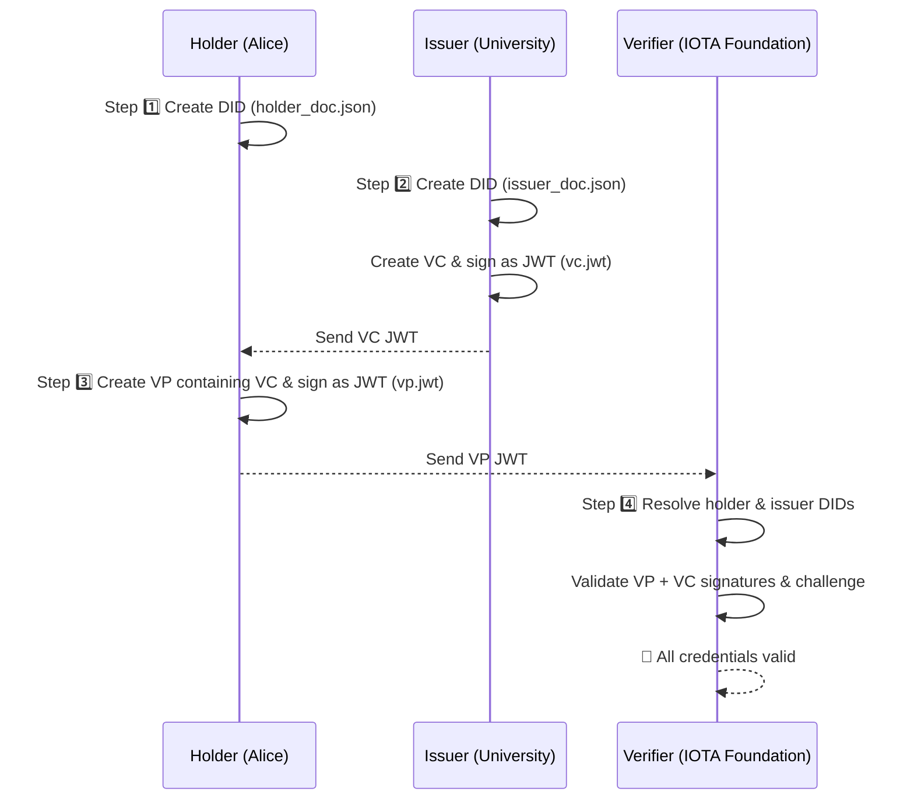

# University Degree Verification Using IOTA Identity (Rust CLI Tutorial)

This step-by-step tutorial demonstrates how to issue, present, and verify academic credentials using [IOTA Identity](https://github.com/iotaledger/identity) in Rust. It is designed as a fully CLI-driven example for verifying university degrees using decentralized identifiers (DIDs), verifiable credentials (VCs), and verifiable presentations (VPs).



## Requirements

Before you begin, make sure you have:

- Rust installed (stable)
- Setup a local IOTA node and request test tokens from faucet

:::info
The holder and issuer will publish their DIDs to this local network, so it must be running first. See how to set up a local [IOTA Network](https://docs.iota.org/developer/iota-identity/getting-started/local-network-setup)
:::

- Deploy the IOTA [identity contract](https://github.com/iotaledger/identity) to your local node. See how to do this [here](https://docs.iota.org/developer/iota-identity/getting-started/local-network-setup#publish-the-iota-identity-package)

## Understanding the Core Concepts Before We Code

Before diving into the code, let's solidify our understanding of the fundamental building blocks:

## 1. Decentralized Identifier (DID)

Imagine your online identity today. It's often scattered across various platforms (Google, Facebook, banks), and you don't truly own it. Centralized entities control your data.

**DID (Decentralized Identifier)** flips this on its head.

- **What it is**: A DID is a globally unique, persistent identifier that you (or an entity like a university or device) own and control, without needing a central authority. It's like having your own, unforgeable digital address on the internet.
- **How it works**: Each DID has a corresponding DID Document, which is a public document published on a decentralized ledger (like the IOTA Tangle in this case). This document contains:
    - **Public Keys**: Cryptographic keys that allow others to verify signatures made by the DID owner or encrypt messages for them.
    - **Service Endpoints**: Information about how to interact with the DID owner (e.g., communication channels).
- **Self-Sovereignty**: The core idea is that you have "self-sovereignty" over your identity. You decide what information to share, with whom, and when.

In our project:

- The **University** will have a DID (as the **Issuer**).
- The **Student** will have a DID (as the **Holder**).
- These DIDs are anchored and publicly discoverable on the **IOTA**.

## 2. Verifiable Credential (VC)

Think of a physical diploma or driver's license. It's a statement issued by a trusted entity about you. A Verifiable Credential is the digital, cryptographically secure version of this.

- **What it is**: A digital data format that represents a set of claims made by an Issuer about a Subject.
- **Key Components**:
    - **Issuer**: The entity that issues the credential (e.g., "University of Oslow"). They digitally sign the VC.
    - **Holder**: The entity to whom the credential is issued (e.g., "Alice"). They receive and store the VC.
    - **Subject**: The entity about whom the claims are made (usually the Holder, but can be someone else).
    - **Claims**: The actual information being attested to (e.g., "Alice has a Bachelor's Degree in Computer Science from University of Oslow, GPA 4.0, issued on 2025-06-23").
- **Verifiability**: Because the VC is cryptographically signed by the Issuer's DID, anyone can cryptographically verify:
    - That the VC was indeed issued by the stated Issuer.
    - That the VC has not been tampered with since its issuance.

In our project:

- The **University** issues a VC stating that Alice has a "Bachelor of Science and Arts" degree.
- The **student**, Alice, becomes the Holder of this VC.

## 3. Verifiable Presentation (VP)

Now, imagine you need to prove you have a degree (your physical diploma) to an employer. You don't hand them your entire educational history; you just show them the diploma. A Verifiable Presentation is the digital equivalent.

- What it is: A container for one or more Verifiable Credentials, created and signed by the Holder.
- Purpose: To enable the Holder to selectively disclose specific VCs (or parts of VCs) to a Verifier, while proving they are the legitimate owner of those credentials.
- Key Aspect: Selective Disclosure: You might have many VCs in your digital wallet (driver's license, passport, health records). When a Verifier asks for proof of age, you create a VP containing only your age claim from your driver's license, not your entire medical history.
- Challenge-Response: Often, a Verifier will issue a "challenge" (a random string) that the Holder must include in their signed VP. This prevents "replay attacks" where an attacker tries to reuse a previously valid VP.

In our project:

- Alice (the Holder) wants to prove her degree to a potential employer (the Verifier).
- She creates a VP, embedding her "University Degree Credential" (the VC) inside it.
- She then signs this VP with her own DID, proving that she is the legitimate holder of that degree.
- The Verifier will check Alice's signature on the VP and then verify the VC inside against the University's DID.

All communication happens via DIDs and JWT-based credentials published and resolved on the IOTA network.

# Getting Started

## 1. Clone the Repository

```bash
git clone https://github.com/iota-community/digitally-validate-a-degree.git
cd digitally-validate-a-degree
```

## 2. Build the Project

```bash
cargo build
```

## Step 1: Holder creates their DID

```bash
IOTA_IDENTITY_PKG_ID=your-package-id cargo run --bin holder
```

This will:

- Generates a new Decentralized Identifier (DID) for the holder (Alice)
- Publishes the DID Document to the local IOTA network (anchored on-chain)
- Publishes the DID Document to the local IOTA network (anchored on-chain)
- Generates & saves a fragment (private key reference) in holder_fragment.txt — used later to sign the VP

## Step 2: Issuer creates their DID and Verifiable Credential (VC)

Run the following to simulate the university issuing a VC:

```bash
IOTA_IDENTITY_PKG_ID=your-package-id cargo run --bin issuer
```

This will:

- Generates a new DID for the Issuer (e.g., University of Oslo)
- Publishes the Issuer’s DID Document on the local IOTA network
- Creates a Verifiable Credential (VC) for Alice (e.g., degree, GPA)
- Signs the VC as a JWT so it can later be presented and verified
- Print the VC JWT (copy this for the next step)

## Step 3: Holder Creates a Verifiable Presentation (VP)

Alice receives the VC and creates a VP to send to the IOTA Foundation.

```bash
IOTA_IDENTITY_PKG_ID=your-package-id cargo run --bin holder "<PASTE_VC_JWT_HERE>"
```

This will:

- Takes the VC JWT issued by the university
- Wraps it into a Verifiable Presentation (VP)
- Signs the VP with Alice’s DID & includes a challenge (to prevent replay attacks)
- Saves the resulting VP JWT as vp.jwt
- Print the VP JWT

## Step 4: Verifier Validates the Verifiable Presentation

The IOTA Foundation (verifier) now checks the authenticity and validity of the VP.

```bash
IOTA_IDENTITY_PKG_ID=your-package-id cargo run --bin verifier "<PASTE_VP_JWT_HERE>"
```

This will:

- Extracts holder’s DID and issuer’s DID from the VP JWT
- Resolves both DID Documents from the local IOTA network
- Verifies the VP JWT signature and checks the challenge matches
- Validates the embedded VC inside the VP to ensure it was really issued by the trusted issuer

If successful, you’ll see:

```bash
🎉 All credentials in the VP are valid!
```

## References

- [IOTA Identity Docs](https://docs.iota.org/iota-identity)

- [W3C VC Data Model](https://www.w3.org/TR/vc-data-model-1.0/)


