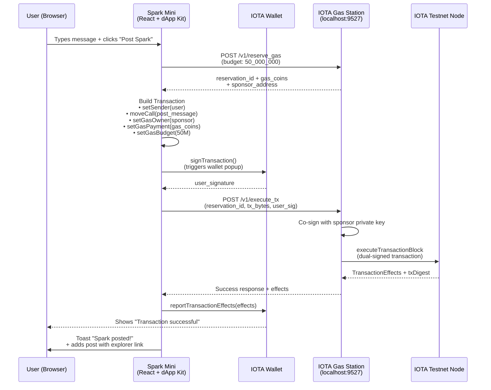

# IOTA Gas Station Workshop

In this hands-on workshop you will build Spark Mini, a fully functional, decentralized microblogging platform where anyone can post messages without owning a single token or paying gas fees.

Spark Mini is a sleek, gas-free microblogging platform built on IOTA testnet. Think Twitter, but with zero fees, no token required, and every post permanently stored on-chain. Using the IOTA Gas Station, the dApp operator quietly pays all transaction costs, so anyone with a wallet can simply connect, type a message, and post instantly, no faucet, no balance, no friction. In this workshop, you’ll build the entire thing from scratch: run your own Gas Station, fund it, and create a beautiful React frontend that delivers real, immutable, on-chain sparks with a single click.


### Why IOTA Gas Station?

In traditional blockchains, users must buy tokens, fund wallets, and pay `gas fees` for every action, like posting a message. This creates massive friction, preventing adoption. IOTA Gas Station solves this by letting dApp operators cover fees, so users focus on creating content. Spark Mini demonstrates this with a Twitter-like platform: posts are immutable on IOTA testnet, but completely free.

### Spark Mini Sponsored Transaction Flow



### Learning Objectives

By the end of this workshop, you will:

- Understand [sponsored transactions](../../developer/iota-101/transactions/sponsored-transactions/about-sponsored-transactions.mdx) and how the [Gas Station](../../operator/gas-station/gas-station.mdx) enables gas-free UX.
- Deploy a local Gas Station and fund it for sponsorship.
- Build a React frontend with [IOTA dApp Kit](../../developer/ts-sdk/dapp-kit/index.mdx) for wallet connection and UI.
- Implement on-chain posting using the [IOTA TypeScript SDK](../../developer/ts-sdk/typescript/index.mdx).
- Integrate the full sponsored flow: reserve gas, user sign, Gas Station co-sign/submit.
- Test and debug your dApp with real testnet transactions.

### Prerequisites

Before starting, ensure you have:

- Basic Knowledge: Familiarity with JavaScript/TypeScript, React, and command line. No prior IOTA experience needed.
- Tools:
    - Node.js (v18+) and npm/yarn.
    - Git.
    - Docker Desktop (for Gas Station deployment).
    - VS Code (recommended).
- Hardware: Mac/Linux/Windows with 4GB+ RAM.

If you're missing anything, install now:

- [Node.js](https://nodejs.org/en/download)
- [Docker](https://docs.docker.com/desktop/setup/install/mac-install/)
- [VS Code](https://code.visualstudio.com/download)

## Part 1 – Project Setup & Architecture

We'll build a full-stack dApp:

- Frontend (`spark-mini-frontend`): React + Vite + dApp Kit for UI, wallet connect, and tx submission.
- Gas Station (official Docker): Sponsors fees; no custom backend needed for this workshop.
- On-Chain Logic: Uses a demo Move package for storing posts (immutable on testnet).

### 1.1 Create the Workshop Folder

```Bash
mkdir spark-mini-workshop && cd spark-mini-workshop
```

This creates a dedicated folder for the entire workshop. All code and services will live here.

### 1.2 Clone the IOTA Gas Station Repository:

```Bash
git clone https://github.com/iotaledger/gas-station
```

### 1.3 Navigate to the Docker Directory and Generate the Config File:

```bash
cd gas-station/docker
../utils/./gas-station-tool.sh generate-sample-config --config-path config.yaml --docker-compose -n testnet
```

### Expected Output:

```bash
Generated a new IOTA address. If you plan to use it, please make sure it has enough funds: '0xc30e6509054a6399d54703de6f028dc4dc6648bd0d389b153dd02275dc846be2'
```

This is the address that will pay for everyone’s transactions.

### 1.4 Fund the Gas Station Sponsor via Faucet

:::info
Follow the steps on [this page](../getting-started/get-coins.mdx) to get test tokens using either the IOTA CLI, cURL, or the TypeScript-SDK.
:::

### 1.5 Start the Gas Station

```bash
GAS_STATION_AUTH=supersecret123 docker compose up
```

:::info
Set Up Authentication: Define a bearer token for the Gas Station API using the `GAS_STATION_AUTH` environment variable. If set, this token must be provided in all requests to the Gas Station, except for the `/` and `/version` endpoints. It can also be omitted to disable default authentication, e.g. if one wants to add a custom authentication to the server. In this case, requests against the Gas Station can be made without an authentication token.
:::

### Expected Output:

When the gas station starts, it will perform the initial coin-splitting procedure. You should see logs similar to the following:

```bash
2024-12-16T17:12:49.369620Z  INFO iota_gas_station::gas_station_initializer: Number of coins got so far: 392
2024-12-16T17:12:49.369690Z  INFO iota_gas_station::gas_station_initializer: Splitting finished. Got 392 coins. New total balance: 39615604800. Spent 384395200 gas in total
2024-12-16T17:12:49.381289Z DEBUG iota_gas_station::storage::redis: After add_new_coins. New total balance: 39615604800, new coin count: 392
2024-12-16T17:12:49.381378Z DEBUG iota_gas_station::storage::redis: Releasing the init lock.
2024-12-16T17:12:49.382094Z  INFO iota_gas_station::gas_station_initializer: New coin initialization took 0s
2024-12-16T17:12:49.383373Z  INFO iota_gas_station::rpc::server: listening on 0.0.0.0:9527
```

### Explanation:

We are deploying the official, production-ready Gas Station using Docker. The `generate-sample-config` tool creates a testnet-ready configuration. The environment variable sets the auth token to `supersecret123`.

### 1.6 Verify the Gas Station is Healthy

```Bash
curl http://localhost:9527
```
### Expected output:

```JSON
{"OK"}
```
### Explanation:

A successful response confirms the RPC server is listening on port 9527 and ready to sponsor transactions, but make sure the sponsored address is funded.

### 1.7 Create the React Frontend

```bash
# 1. Go back to the workshop root folder
cd ..

# 2. Create the React frontend (Vite + TypeScript template)
npx create-vite@latest frontend --template react-ts

# 3. Enter the frontend folder
cd frontend

# 4. Install default dependencies (Vite, React, etc.)
npm install

# 5. Install IOTA and workshop-specific packages
npm install @iota/dapp-kit @iota/iota-sdk @tanstack/react-query axios
```

### Explanation:
We scaffold a modern Vite + React + TypeScript project and install:

- @iota/dapp-kit – wallet connection and hooks
- @iota/iota-sdk – transaction building
- `axios` – HTTP calls to the Gas Station

### 1.8 Start the Dev Server

```Bash
npm run dev
```
### Explanation:
Your frontend is now live at http://localhost:5173. You’ll see a blank page for now, that’s expected.

## Part 2 – Wallet Connection with dApp Kit

### 2.1 Replace `src/main.tsx` (Providers)

```tsx
// src/main.tsx
import React from 'react';
import ReactDOM from 'react-dom/client';
import App from './App.tsx';
import {
  createNetworkConfig,
  IotaClientProvider,
  WalletProvider,
} from '@iota/dapp-kit';
import { getFullnodeUrl } from '@iota/iota-sdk/client';
import { QueryClient, QueryClientProvider } from '@tanstack/react-query';
import '@iota/dapp-kit/dist/index.css';

const { networkConfig } = createNetworkConfig({
  testnet: { url: getFullnodeUrl('testnet') },
});

const queryClient = new QueryClient();

ReactDOM.createRoot(document.getElementById('root')!).render(
  <React.StrictMode>
    <QueryClientProvider client={queryClient}>
      <IotaClientProvider networks={networkConfig} defaultNetwork="testnet">
        <WalletProvider>
          <App />
        </WalletProvider>
      </IotaClientProvider>
    </QueryClientProvider>
  </React.StrictMode>
);
```
### Explanation:

These providers are mandatory for any dApp Kit hook to work (`useWallets`, `useSignTransaction`, etc.). The CSS import gives us the beautiful default ConnectButton styling.

### 2.2 Basic UI with ConnectButton

```tsx
// src/App.tsx (replace everything)
import React from 'react';
import { ConnectButton, useWallets } from '@iota/dapp-kit';

export default function App() {
  const wallets = useWallets();
  const connectedWallet = wallets.find(w => w.accounts.length > 0);
  const address = connectedWallet?.accounts[0]?.address;

  return (
    <div style={{ maxWidth: 600, margin: '40px auto', textAlign: 'center', fontFamily: 'system-ui' }}>
      <h1>Spark Mini</h1>
      <p>Gas-free microblogging on IOTA testnet</p>
      {!connectedWallet ? (
        <>
          <h2>Connect your wallet to start posting</h2>
          <ConnectButton />
        </>
      ) : (
        <p>Connected: {address?.slice(0, 12)}...{address?.slice(-8)}</p>
      )}
    </div>
  );
}
```

### Explanation:

`useWallets` returns all detected wallets. When a user connects, `accounts.length > 0`. The `ConnectButton` automatically opens the official modal and handles all wallet standards.
Test it: Click Connect → Choose IOTA Wallet → Success! You now see your address.


## Part 3 – Implement the Sponsored Post Flow

### 3.1 Add Constants & Imports

```tsx
// Top of src/App.tsx (add these)
import { useIotaClient, useSignTransaction } from '@iota/dapp-kit';
import { Transaction } from '@iota/iota-sdk/transactions';
import axios from 'axios';

const GAS_STATION_URL = '/api/gas';
const GAS_STATION_AUTH = 'supersecret123';
const PACKAGE_ID = '0x2'; // Official demo package
```

### Explanation:

- P`ACKAGE_ID` is the official demo media package that contains post_message(string).
- The Gas Station URL and auth token match our Docker setup.

### 3.2 Full Post Handler (copy-paste this function)

```tsx
const client = useIotaClient();
const { mutateAsync: signTransaction } = useSignTransaction();
const [content, setContent] = useState('');
const [posts, setPosts] = useState<Array<{content: string, author: string, txid: string}>>([]);

  const handlePost = async () => {
  if (!isConnected || !address || !content.trim()) {
    showToast('Connect your wallet and write a spark first!');
    return;
  }

  setLoading(true);
  try {
    // 1. Build the transaction (gas-less at this point)
    const tx = new Transaction();
    tx.setSender(address);
    tx.moveCall({
      target: `${PACKAGE_ID}::media::post_message`,
      arguments: [tx.pure.string(content)],
    });

    // 2. Reserve gas from your Gas Station
    const gasBudget = 50_000_000;
    const reserveRes = await axios.post(
      `${GAS_STATION_URL}/v1/reserve_gas`,
      { gas_budget: gasBudget, reserve_duration_secs: 120 },
      { headers: { Authorization: `Bearer ${GAS_STATION_AUTH}` } }
    );

    const { sponsor_address, reservation_id, gas_coins } = reserveRes.data.result;

    // 3. Attach sponsor's gas data
    tx.setGasOwner(sponsor_address);
    tx.setGasPayment(gas_coins);
    tx.setGasBudget(gasBudget);

    // 4. Build unsigned transaction bytes (needed for Gas Station)
    const unsignedTxBytes = await tx.build({ client });

    // 5. User signs via dApp Kit hook (wallet popup appears)
    const { signature, reportTransactionEffects } = await signTransaction({
      transaction: tx,
    });

    // 6. Send unsigned bytes + user signature to Gas Station for co-sign & submit
    const txBytesBase64 = btoa(String.fromCharCode(...new Uint8Array(unsignedTxBytes)));
    const executeRes = await axios.post(
      `${GAS_STATION_URL}/v1/execute_tx`,
      {
        reservation_id,
        tx_bytes: txBytesBase64,
        user_sig: signature,
      },
      { headers: { Authorization: `Bearer ${GAS_STATION_AUTH}` } }
    );

    const txDigest = executeRes.data.effects.transactionDigest;

    // 7. Report effects back to the wallet (required by useSignTransaction)
    reportTransactionEffects(executeRes.data.effects);

    // 8. Update the UI
    setPosts(prev => [
      {
        content,
        author: address.slice(0, 10) + '...',
        txid: txDigest,
        timestamp: Date.now(),
      },
      ...prev,
    ]);
    setContent('');
    showToast('Spark posted on-chain!');

  } catch (err) {
    console.error('Post failed:', err);

    let errorMessage = 'Transaction failed';
    if (err instanceof Error) {
      errorMessage = err.message;
    } else if (err && typeof err === 'object' && 'response' in err) {
      const axiosErr = err as { response?: { data?: { error?: string } } };
      errorMessage = axiosErr.response?.data?.error ?? 'Request failed';
    }

    showToast('Failed: ' + errorMessage);
  } finally {
    setLoading(false);
  }
};
```


### Explanation:

This is the complete sponsored transaction flow:

- User builds intent
- Reserves gas from sponsor
- Attaches sponsor’s gas objects
- Signs with wallet (IOTA Wallet popup)
- Gas Station co-signs and submits
- Success → on-chain forever!

### 3.3 Final UI with Textarea & Feed

Replace the return block with this beautiful final version (includes textarea, button, and feed).

```tsx
return (
  <div style={{ maxWidth: 600, margin: '40px auto', fontFamily: 'system-ui' }}>
    <h1>Spark Mini</h1>
    <p>Gas-free microblogging on IOTA testnet</p>

    {!address ? (
      <div style={{ textAlign: 'center', marginTop: 80 }}>
        <h2>Connect your wallet to post</h2>
        <ConnectButton />
      </div>
    ) : (
      <>
        <p>Connected: {address.slice(0, 12)}...{address.slice(-8)}</p>
        <textarea
          value={content}
          onChange={e => setContent(e.target.value)}
          placeholder="What's your spark? (280 chars)"
          maxLength={280}
          rows={4}
          style={{ width: '100%', padding: 12, fontSize: 16, borderRadius: 8, border: '1px solid #ccc' }}
        />
        <button
          onClick={handlePost}
          style={{ marginTop: 12, padding: '12px 24px', background: '#0068FF', color: 'white', border: 'none', borderRadius: 8, fontSize: 16 }}
        >
          Post Spark
        </button>

        <hr style={{ margin: '40px 0' }} />

        {posts.map((p, i) => (
          <div key={i} style={{ padding: 16, border: '1px solid #eee', borderRadius: 12, marginBottom: 12 }}>
            <strong>{p.author}:</strong> {p.content}
            <br />
            <small>
                    <a
                      href={`https://explorer.iota.org/?network=testnet&transaction=${p.txid}`}
                      target="_blank"
                      rel="noreferrer"
                      style={{ color: '#0068FF' }}
                    >
                      View on Explorer
                    </a>
            </small>
          </div>
        ))}
      </>
    )}
  </div>
);
```

### Explanation:

Clean, responsive UI with live feed and explorer links. Every post is permanently stored on IOTA testnet.


## Final Test

- `npm run dev`
- Connect IOTA Wallet
- Type a message → Post Spark
- Approve in wallet
- Success! Your message appears + explorer link works

## Resources

- [Gas Station Docs:](https://docs.iota.org/operator/gas-station)
- [dApp Kit:](https://docs.iota.org/developer/ts-sdk/dapp-kit)
- [Discord:](https://discord.com/invite/iota-builders)