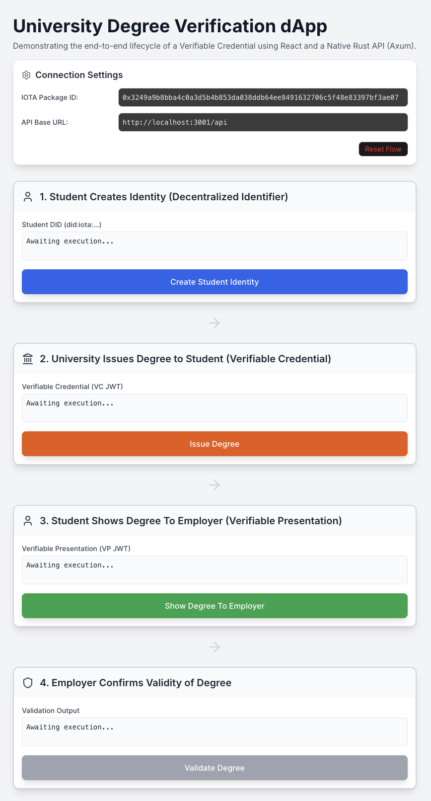
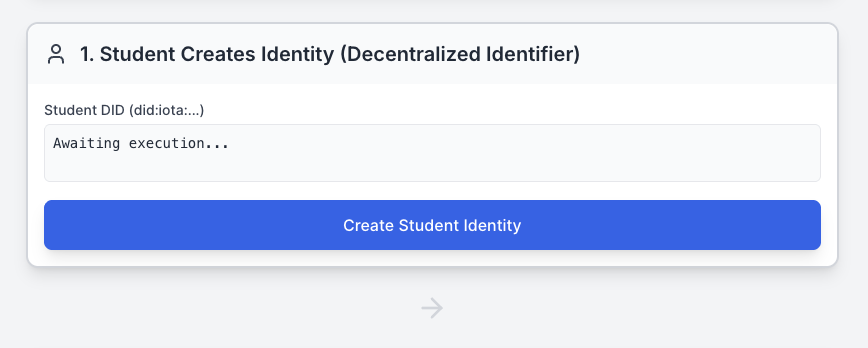
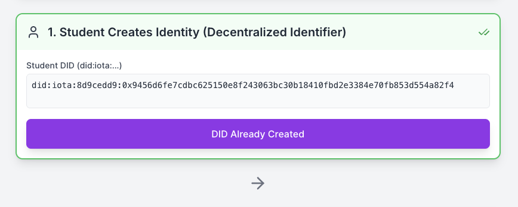
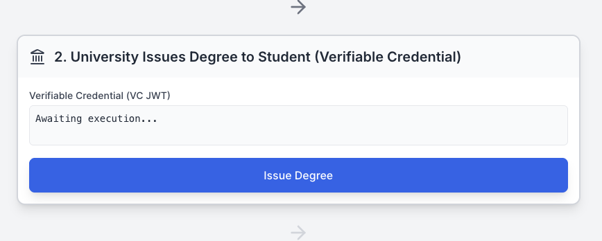
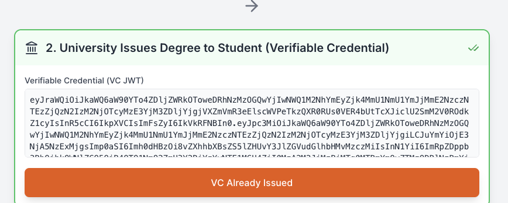
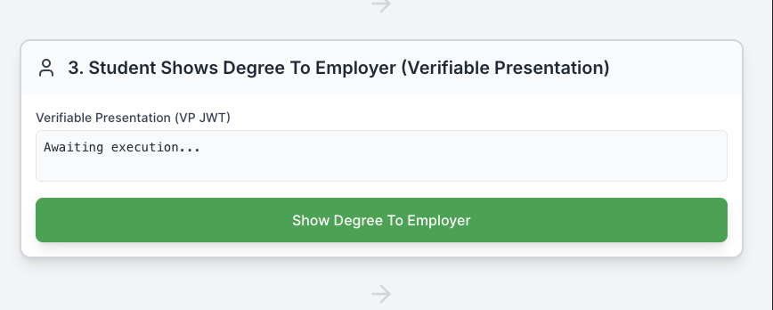
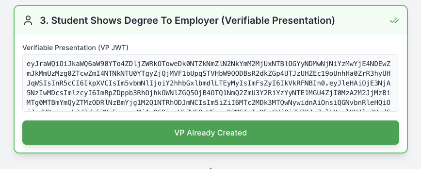
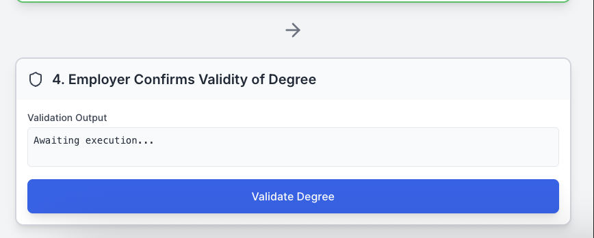
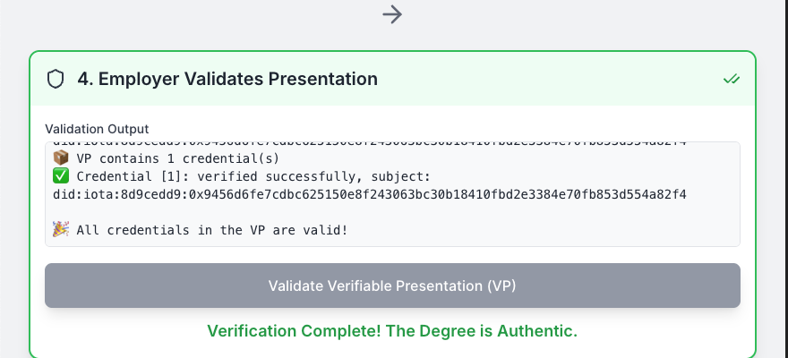

# IOTA Identity Workshop

In this workshop, we will build a production-ready **University Degree Verification system** using **IOTA Identity**, **Rust**, and **React.** By the end of this workshop, you’ll have a complete, end-to-end flow demonstrating how **universities**, **students**, and **employers** interact in a real-world university degree validation scenario — all powered by IOTA Identity. We will build the application piece-by-piece, focusing on the communication flow for each of the four core identity steps (Decentralized Identifier creation, Verifiable Credential issuance, Verifiable Presentation creation, and Verification).

This is a snapshot of how the frontend looks.



## The Problem

Today, verifying university degrees is a slow, manual, and often costly hurdle. Employers must contact universities or rely on centralized third-party services, which is costly and prone to fraud. Fake certificates can easily circulate.

## The Opportunity

Universities can issue tamper-proof University Degrees that students control using the IOTA Identity. Students present these credentials to employers, who can instantly verify them on the IOTA network without intermediaries, cutting costs and eliminating fraud.

### What You’ll Build in this Workshop

We're building a complete, system that connects a modern React frontend to a high-performance Rust backend. You'll learn how the frontend triggers the entire IOTA Identity lifecycle:

- **Student (Holder)**: Creates a **Decentralized Identifier (DID)** and stores it securely.
- **University (Issuer)**: Issues a **Verifiable Credential (VC)** representing the degree.
- **Student**: Packages the credential into a **Verifiable Presentation (VP)** and signs it.
- **Employer (Verifier)**: Verifies the authenticity of the presentation and credentials against the IOTA network.

:::tip Here are some alternative use cases
- **Use Case 2:** IOTA Identity unifies your fragmented digital presence under a single, self-controlled Decentralized Identifier (DID), giving you secure ownership and selective control over your personal data.

- **Use Case 3:** IOTA Identity enables verifiable, tamper-proof product credentials across supply chains, allowing consumers to trust a product’s authenticity and sustainability claims.

- **Use Case 4:** IOTA Identity secures digital asset provenance by linking tokens to verified real-world identities and origins, preventing fraud and ensuring authenticity.
:::

## Understanding Key Terms

Before diving into the workshop, let’s clarify three key IOTA Identity concepts used in our University Degree Verification system. These terms, Decentralized Identifier (DID), Verifiable Credential (VC), and Verifiable Presentation (VP)—are central to how we create, issue, share, and verify a digital university degree securely on the IOTA network.

- **Decentralized Identifier (DID)**: A DID is a unique digital ID, like a secure online passport, that identifies someone or something without relying on a central authority. In this workshop:
  - The **student (Holder)** creates a DID to represent their identity.
  - The **university (Issuer)** has its own DID to prove it’s a trusted institution.
  - The **employer (Verifier)** uses DIDs to check who issued and holds the degree.
  - Example: A student’s DID might look like `did:iota:abc123...`, proving they are the legitimate owner of their degree.

- **Verifiable Credential (VC)**: A VC is a tamper-proof digital document that proves something about its holder, signed by a trusted issuer. In this workshop:
  - The VC is the **university degree** issued by the university to the student.
  - It contains details like the student’s name, degree type (e.g., Bachelor of Science), and issuance date, all cryptographically signed to prevent fraud.
  - Example: The university issues a VC saying, “Jane Doe earned a B.Sc. in Computer Science on May 2025.”

- **Verifiable Presentation (VP)**: A VP is a way for the holder to share their VC (or parts of it) with someone else, proving its authenticity. In this workshop:
  - The student creates a VP to **present their degree** to an employer.
  - The VP is signed by the student’s DID, proving they are the rightful holder of the degree, and includes the VC from the university.
  - Example: Jane Doe sends a VP to an employer, showing her degree is valid without revealing unnecessary personal details.

These concepts work together to create a secure, decentralized system where the student controls their digital degree, the university issues it with trust, and the employer verifies it instantly using the IOTA network. In the steps ahead, you’ll build this system by creating a DID, issuing a VC, presenting a VP, and verifying it!

**Next Steps**: Proceed to the setup sections to install the tools needed for the workshop.

## Prerequisites

Before starting this workshop, make sure you have:

- **Rust** (latest stable version) installed → Install Rust
- **Cargo** (comes with Rust) for building and running projects
- A **local IOTA network** running with the IOTA Identity contract deployed
    - See [Local Network Setup](https://docs.iota.org/developer/iota-identity/getting-started/local-network-setup)
    - Ensure you can request test tokens from the faucet
- A code editor such as **VS Code**
- (Optional but recommended) Basic familiarity with:
    - **IOTA Decentralized Identifiers (DIDs)**
    - **IOTA Verifiable Credentials (VCs)** and **IOTA Verifiable Presentations (VPs)**
### Installing Rust and Cargo

Rust and Cargo are required for the Rust backend of the IOTA Identity workshop. Select your operating system below to view the installation instructions:

<Tabs groupId="os-install" defaultValue="macos">
  <TabItem value="macos" label="macOS">
    ### Step 1: Install `rustup` (The Rust Installer)

    Open your Terminal application and run the following command to download and start the `rustup` installer:

    ```bash
    curl --proto '=https' --tlsv1.2 -sSf https://sh.rustup.rs | sh
    ```

    You will see a prompt with installation options:
    1. Type `1` (for "Proceed with installation (default)").
    2. Press Enter.

    ### Step 2: Configure Your Shell Environment

    After installation, update your shell's profile to make the `cargo` command available. For Zsh (the default shell on modern macOS), run:

    ```bash
    source $HOME/.cargo/env
    ```

    :::note
    
    If using Bash, the command might be `source $HOME/.bashrc`. The `rustup` installer will display the correct command upon completion. Restart your terminal if needed.

    :::

    ### Step 3: Verify the Installation

    Confirm that Rust and Cargo are installed correctly:

    1. **Check Rust Version**:

       ```bash
       rustc --version
       ```

       Expected Output: `rustc 1.XX.0 (long_hash_string)`

    2. **Check Cargo Version** (Cargo is the build system and package manager):

       ```bash
       cargo --version
       ```

       Expected Output: `cargo 1.XX.0 (long_hash_string)`

    ### Step 4: Update (Maintenance)

    To ensure the latest stable libraries for IOTA Identity, update your Rust toolchain:

    ```bash
    rustup update stable
    ```
  </TabItem>

  <TabItem value="windows" label="Windows">
    ### Step 1: Install `rustup` (The Rust Installer)

    1. Open a web browser and navigate to [https://www.rust-lang.org/tools/install](https://www.rust-lang.org/tools/install).
    2. Download the `rustup-init.exe` installer for Windows by clicking the "Download" button.
    3. Run the downloaded `rustup-init.exe` file (click "Run" or confirm any security prompt).
    4. In the command-line window that opens:
       - Type `1` (for "Proceed with installation (default)") and press Enter.
       - Follow any additional prompts to complete the installation.

    :::note
    
    If you encounter permission issues, right-click `rustup-init.exe` and select "Run as administrator".

    :::
    ### Step 2: Configure Your Environment

    The Rust installer automatically adds Rust and Cargo to your system PATH. To apply these changes:
    1. Close your current Command Prompt (if open).
    2. Open a new Command Prompt by searching for "cmd" in the Start menu.
    3. Alternatively, restart your computer to ensure PATH updates take effect.

    > **Tip**: If `cargo` isn’t recognized in Step 3, ensure `C:\Users\<YourUsername>\.cargo\bin` is in your PATH (check with `echo %PATH%` in Command Prompt).

    ### Step 3: Verify the Installation

    Confirm that Rust and Cargo are installed correctly:

    1. **Check Rust Version**:

       ```cmd
       rustc --version
       ```

       Expected Output: `rustc 1.XX.0 (long_hash_string)`

    2. **Check Cargo Version** (Cargo is the build system and package manager):

       ```cmd
       cargo --version
       ```

       Expected Output: `cargo 1.XX.0 (long_hash_string)`

    > **Troubleshooting**: If either command returns "not recognized," ensure Rust was installed correctly and the PATH is updated. Try running Command Prompt as administrator or restarting your system.

    ### Step 4: Update (Maintenance)

    To ensure the latest stable libraries for IOTA Identity, update your Rust toolchain:

    ```cmd
    rustup update stable
    ```
  </TabItem>
</Tabs>

### Step 5: Local Network Setup

:::tip
Use this page to set up a [Local IOTA Network](https://docs.iota.org/developer/iota-identity/getting-started/local-network-setup)
:::

### Step 6: Install Visual Studio Code

Visual Studio Code (VS Code) is a lightweight code editor that you'll use to edit and run the Rust and React code for this IOTA Identity workshop. Follow the instructions below to install VS Code on your operating system.

<Tabs groupId="os-install" defaultValue="macos">
  <TabItem value="macos" label="macOS">
    ### Step 6: Install Visual Studio Code on macOS

    1. **Download VS Code**:
       - Visit the [Visual Studio Code download page](https://code.visualstudio.com/download).
       - Click the "macOS" button to download the installer (usually a `.zip` file).

    2. **Locate the Downloaded File**:
       - Open your browser’s download list (e.g., in Safari, click the downloads icon in the toolbar).
       - Find the downloaded file, typically named `VSCode-darwin-universal.zip`.

    3. **Extract the Archive**:
       - Double-click the `.zip` file to extract it, which creates `Visual Studio Code.app`.
       - If the file doesn’t extract automatically, check your Downloads folder and unzip it manually.

    4. **Move to Applications**:
       - Drag `Visual Studio Code.app` to the `Applications` folder in Finder to make it available in Launchpad.

    5. **Open VS Code**:
       - Navigate to the `Applications` folder and double-click `Visual Studio Code.app` to launch it.
       - If prompted with a security warning ("App is from an unidentified developer"), right-click the app, select "Open," and confirm.

    6. **Add to Dock (Optional)**:
       - While VS Code is running, right-click its icon in the Dock.
       - Choose **Options > Keep in Dock** to add it for easy access.

    7. **Verify Installation**:
       - Open VS Code and ensure the welcome screen appears.
       - Open a terminal in VS Code (click **Terminal > New Terminal**) and type `code --version` to confirm the installation.

    Once these steps are complete, VS Code is ready for the workshop!
  </TabItem>

  <TabItem value="windows" label="Windows">
    ### Step 6: Install Visual Studio Code on Windows

    1. **Download VS Code**:
       - Visit the [Visual Studio Code download page](https://code.visualstudio.com/download).
       - Click the "Windows" button to download the installer (typically `VSCodeUserSetup-x64.exe`).

    2. **Locate the Downloaded File**:
       - Open your browser’s download list (e.g., in Edge, click the downloads icon in the toolbar).
       - Find the downloaded file in your `Downloads` folder, named something like `VSCodeUserSetup-x64.exe`.

    3. **Run the Installer**:
       - Double-click the `.exe` file to start the installation.
       - If prompted by User Account Control (UAC), click **Yes** to allow the installer to run.
       - Follow the setup wizard:
         - Accept the license agreement.
         - Choose the default installation location (e.g., `C:\Users\<YourUsername>\AppData\Local\Programs\Microsoft VS Code`).
         - Select **Add to PATH** (recommended for running `code` from the command line).
         - Optionally, check **Create a desktop icon** for quick access.
         - Click **Install** and then **Finish** when complete.

    4. **Open VS Code**:
       - Double-click the VS Code desktop icon, or search for "Visual Studio Code" in the Start menu and launch it.

    5. **Add to Taskbar (Optional)**:
       - While VS Code is running, right-click its icon in the taskbar.
       - Select **Pin to taskbar** for easy access.

    6. **Verify Installation**:
       - Open VS Code and ensure the welcome screen appears.
       - Open a terminal in VS Code (click **Terminal > New Terminal**) and type `code --version` to confirm the installation.

    Once these steps are complete, VS Code is ready for the workshop!
  </TabItem>
</Tabs>

**Next Steps**: With VS Code installed, proceed to the next section to set up the project and Architecture for the Rust backend and React frontend.

## Part 1: Project Setup and Architecture

We will create two separate projects that communicate via HTTP: the React Frontend (the user interface) and the Rust Axum Backend (the identity logic engine).

### Step 1.1: Project Initialization

Start by creating the root folder and initializing the two sub-projects.

```bash
# Create the root folder
mkdir iota-identity-workshop
cd iota-identity-workshop

# 1. Initialize the Rust Backend
mkdir iota-identity-backend
cd iota-identity-backend
cargo init

# 2. Set up utility folder for Rust logic
mkdir -p crates/identity_logic/src

# 3. Initialize the React Frontend
cd ..
mkdir iota-identity-frontend
cd iota-identity-frontend
npm create vite@latest . -- --template react
npm install
npm install lucide-react # For icons
```
### Explanation:

- **What it does**: Creates a project structure with a Rust backend (`iota-identity-backend`) and a React frontend (`iota-identity-frontend`). The `cargo init` command sets up a Rust project with a `Cargo.toml` file, while `npm create vite` initializes a React app using Vite for fast development. The `lucide-react` library adds icons for the UI.
- **Why it matters**: This sets up a full-stack environment where the frontend handles user interaction and the backend processes IOTA Identity logic. The utility folder (`crates/identity_logic`) will hold shared Rust code.
- **Key concepts**:
    - **Rust Backend**: Uses Axum for HTTP APIs to handle IOTA Identity operations.
    - **React Frontend**: Provides a user-friendly interface to trigger backend actions.
    - **Vite**: A modern build tool for fast React development.

### Code Scaffold

Before starting the IOTA Identity workflow, set up the foundational code for the Rust backend (`main.rs`) and React frontend (`App.jsx`). This scaffold includes imports, data structures, and server/client setup needed to run the project.

:::info
Visit GitHub for the Scaffold Code,  copy the code for [main.rs](https://github.com/iota-community/workshops/blob/main/workshop-module-10/backend-scaffold.rs) and [App.jsx](https://github.com/iota-community/workshops/blob/main/workshop-module-10/frontend-scaffold.jsx).
:::

**Next Steps**: After setting up the scaffold, return to this workshop to implement the IOTA Identity functionality in Steps 1–4, where you'll add code to create, issue, present, and verify a university degree credential.

## Part 2: Building the Front-to-Back Connection

This section demonstrates how every button on the frontend connects to a specific function on the Rust backend, completing the identity flow.



### The Communication Layer (`handleApiCall`)

In your **React Frontend** (`src/App.jsx`), this function is the central bridge. It standardizes how all API requests are made, ensuring the required `packageId` and error handling are used for every step.

```JavaScript
// src/App.jsx (Excerpt: handleApiCall)

const handleApiCall = useCallback(async (step, endpoint, body) => {
        if (!packageId || packageId === 'your-iota-identity-pkg-id') {
            setError('Please set a valid IOTA Identity Package ID in the settings.');
            return null;
        }
        if (!apiUrl) {
            setError('Please set the API Base URL in the settings.');
            return null;
        }

        setLoadingStep(step);
        setError('');
        
        // This is a minimal exponential backoff retry logic
        const maxRetries = 3;
        const initialDelay = 1000;

        for (let attempt = 0; attempt < maxRetries; attempt++) {
            try {
                // NOTE: The body keys (packageId, vcJwt, vpJwt) MUST be camelCase to match the #[serde(rename_all = "camelCase")] in Rust.
                const response = await fetch(`${apiUrl}${endpoint}`, {
                    method: 'POST',
                    headers: { 'Content-Type': 'application/json' },
                    body: JSON.stringify({ packageId, ...body }),
                });

                if (!response.ok) {
                    const errorText = await response.text();
                    throw new Error(`API returned status ${response.status}: ${errorText}`);
                }

                const data = await response.json();
                setLoadingStep(0);
                return data;

            } catch (err) {
                if (attempt === maxRetries - 1) {
                    setError(`Error in Step ${step}: ${err.message}`);
                    setLoadingStep(0);
                    return null;
                }
                // Exponential backoff
                const delay = initialDelay * (2 ** attempt);
                await new Promise(resolve => setTimeout(resolve, delay));
                console.warn(`Retrying Step ${step} (${attempt + 1}/${maxRetries})...`);
            }
        }
    }, [packageId, apiUrl]);
```

### Explanation:

- What it does: This function sends HTTP POST requests to the Rust backend’s API endpoints (e.g., `/holder/create-did`). It includes a `packageId` (required for IOTA Identity) and handles errors by checking the response status. The result (e.g., a Decentralized Identifier or JWT) is returned to update the frontend state.
- Why it matters: Centralizes API communication, ensuring consistent error handling and payload formatting across all steps. The `useCallback` hook optimizes performance by memoizing the function.
- Key concepts:
    - HTTP POST: Sends data (e.g., `packageId, vcJwt`) to the backend.
    - Error Handling: Catches HTTP errors (e.g., 404, 500) and displays meaningful messages.
    - State Updates: Stores results (e.g., Decentralized Identifier, JWT) in React state for display.

### Student Creates Identity

| Frontend Action | Rust Endpoint | Payload Sent (Body) | Result Stored (State) |
| :--- | :--- | :--- | :--- |
| **Button Click** (`handleCreateDid`) | `/holder/create-did` | `{ "": "..." }` | `did` (string) |

**Frontend** (`src/App.jsx`): We define the handler to call the API endpoint and update the state.

```JavaScript
// src/App.jsx (Holder DID Handler)

const handleCreateDid = async () => {
    // Calls the Rust endpoint. Body is empty as the DID logic is self-contained.
    const data = await handleApiCall(1, '/holder/create-did', {}); 
    if (data && data.did) {
        setDid(data.did); // Stores the returned DID string
    }
};

// This handler is attached to the "Execute Step 1" button.
```

### Explanation:

- **What it does**: The `handleCreateDid` function triggers a POST request to the backend’s `/holder/create-did endpoint`. It sends an empty body since the backend handles all Decentralized identifier creation logic. The returned Decentralized Identifier string is stored in the React state (`setDid`) for display in the UI.
- **Why it matters**: This initiates the IOTA Identity flow by creating a unique identifier for the student (`Holder`), which is used in later steps (e.g., VC issuance). It connects the frontend button to the backend logic.
- **Key concepts**:
    - **DID**: A decentralized identifier (e.g., `did:iota:...`) that uniquely identifies the student.
    - **React State**: Stores the Decentralized Identifier for display and use in subsequent steps.
    - **API Call**: Uses `handleApiCall` to communicate with the backend.

**Backend** (`src/main.rs`): The Rust function uses the received `package_id` to initialize the client and runs the core creation logic.

```Rust
// iota-identity-backend/src/main.rs (holder_create_did)
async fn holder_create_did(Json(_body): Json<PackageId>) -> Result<Json<DidResponse>, StatusCode> {
    let holder_doc_file = "./holder_doc.json";
    let holder_fragment_file = "./holder_fragment.txt";
    let stronghold_path = "./holder.stronghold";

    // This calls create_or_load_did. If the file exists, it loads the existing DID.
    // The DID is anchored and funded if newly created.
    let (holder_doc, _) = create_or_load_did(
        holder_doc_file,
        holder_fragment_file,
        stronghold_path
    ).await.map_err(|e| {
        eprintln!("Error creating holder DID: {:?}", e);
        StatusCode::INTERNAL_SERVER_ERROR
    })?;

    Ok(Json(DidResponse {
        did: holder_doc.id().to_string(),
    }))
}
```
### Explanation:

- **What it does**: The `holder_create_did` function handles the `/holder/create-did` endpoint. It calls `create_or_load_did` (a utility function) to either create a new Decentralized Identifier or load an existing one from `holder_doc.json`. The Decentralized Identifier is anchored to the IOTA network, and the function returns a JSON response containing the Decentralized Identifier string.
- **Why it matters**: This creates the student’s identity on the IOTA network, stored securely using Stronghold. The Decentralized Identifier is the foundation for issuing and verifying credentials.
- **Key concepts**:
    - **Decentralized Identifier** Creation: Uses IOTA Identity to generate and publish a Decentralized Identifier document.
    - **Stronghold**: Securely stores the Decentralized Identifier’s private keys.
    - **Axum Endpoint**: Handles HTTP requests and returns JSON responses.

The `create_or_load_did` function is a critical helper function used by the `holder_create_did` endpoint to either create a new Decentralized Identifier (DID) for the Student (Holder) or load an existing one from disk.

```Rust
// iota-identity-backend/src/main.rs (create_or_load_did)

// Helper function to create or load a DID document and its signing fragment
async fn create_or_load_did(
    doc_file: &str,
    fragment_file: &str,
    stronghold_path: &str,
) -> Result<(IotaDocument, String)> {
    let storage = get_stronghold_storage(Some(PathBuf::from(stronghold_path)))?;

    if !PathBuf::from(doc_file).exists() {
        let client = get_funded_client(&storage).await?;
        let (doc, frag) = create_did_document(&client, &storage).await?;
        
        // Save to disk for persistence between server restarts
        fs::write(doc_file, doc.to_json()?)?;
        fs::write(fragment_file, &frag)?;

        println!(">> Created DID: {}", doc.id());
        Ok((doc, frag))
    } else {
        let doc_json = fs::read_to_string(doc_file)?;
        let doc = IotaDocument::from_json(&doc_json)?;
        let frag = fs::read_to_string(fragment_file)?.trim().to_string();
        
        println!(">> Loaded DID: {}", doc.id());
        Ok((doc, frag))
    }
}
```
### Explanation:

- **What it does**: The `create_or_load_did` function checks if a Decentralized Identifier document exists at the specified `doc_file` path. If it doesn’t exist, it creates a new Decentralized Identifier using the IOTA Identity library, funds it via an IOTA client, and saves the Decentralized Identifier document and its signing fragment to `doc_file` and `fragment_file` respectively. If the file exists, it loads the Decentralized Identifier document and fragment from disk. The function returns a tuple containing the `IotaDocument` (the Decentralized Identifier document) and a `String` (the signing fragment).
- **Why it matters**: This function ensures the Student’s Decentralized Identifier is either created and anchored to the IOTA network or loaded for reuse, providing persistence across server restarts. It abstracts the complexity of Decentralized Identifier creation and storage, making it reusable across different endpoints (e.g., `holder_create_did`).
- **Key concepts**:
    - **Decentralized Identifier Document**: A JSON object containing the student’s decentralized identifier (e.g., `did:iota`:...) and associated data like public keys.
    - **Stronghold Storage**: A secure storage system for private keys, accessed via `get_stronghold_storage`.
    - **Signing Fragment**: A reference to the verification method (e.g., an `Ed25519 key`) used for signing credentials or presentations.
    - **Persistence**: Saves the Decentralized Identifier and fragment to disk to avoid recreating them, ensuring consistency in the identity flow.
    - **IOTA Client**: The `get_funded_client` function provides a funded client to anchor the Decentralized Identifier to the IOTA network.

### Context

The `create_or_load_did` function, used by the `holder_create_did` endpoint, relies on three helper functions to create or load a Decentralized Identifier. These functions, defined in `crates/identity_logic/src/lib.rs`, handle interactions with the IOTA Identity framework and the IOTA network, enabling the creation and management of Decentralized Identifiers (DIDs) for the Student (holder).

- `get_stronghold_storage`: Sets up secure storage for private keys.
- `get_funded_client`: Creates an IOTA Identity client with sufficient funds for network operations.
- `create_did_document`: Generates and publishes a Decentralized Identifier document to the IOTA network.

Below, we explain each function, including its purpose, functionality, and role in the workshop’s identity flow.

### Helper Function: `get_stronghold_storage`

This function initializes a Stronghold storage instance for securely managing cryptographic keys.

```rust
// iota-identity-backend/crates/identity_logic/src/lib.rs (get_stronghold_storage)

/// Returns a StrongholdStorage instance for persistent key storage.
pub fn get_stronghold_storage(
    path: Option<PathBuf>,
) -> Result<Storage<StrongholdStorage, StrongholdStorage>, anyhow::Error> {
    let path = path.unwrap_or_else(random_stronghold_path);
    let password = Password::from("secure_password".to_owned());
    let stronghold = StrongholdSecretManager::builder()
        .password(password.clone())
        .build(path.clone())?;
    let stronghold_storage = StrongholdStorage::new(stronghold);
    Ok(Storage::new(
        stronghold_storage.clone(),
        stronghold_storage.clone(),
    ))
}
```

### Explanation:

- **What it does**: The `get_stronghold_storage` function creates a `StrongholdStorage` instance, which is used to securely store cryptographic keys. It takes an optional file path (`path`) for the Stronghold file; if none is provided, it generates a random path using `random_stronghold_path`. The function sets a default password (`secure_password`), builds a `StrongholdSecretManager`, and wraps it in a `StrongholdStorage` instance, returning it as a `Storage` type compatible with IOTA Identity.
- **Why it matters**: Secure key storage is essential for managing private keys used in Decentralized Identifier creation, Verifiable Credential issuance, and Verifiable Presentation signing. Stronghold ensures keys are encrypted and protected, preventing unauthorized access. This function provides a reusable storage setup for all identity operations in the workshop.
- **Key concepts**:
    - **Stronghold**: A secure storage system for cryptographic keys.
    - *PathBuf*: A Rust type for handling file paths, used to specify where the Stronghold file is stored.
    - **Password**: Secures the Stronghold file to prevent unauthorized access.
    - **Storage Type**: Combines key storage (`JwkStorage`) and key ID storage (`KeyIdStorage`) for IOTA Identity compatibility.

### Helper Function: `get_funded_client`

This function creates an IOTA Identity client with sufficient funds for network operations.

```rust
// iota-identity-backend/crates/identity_logic/src/lib.rs (get_funded_client)

/// Returns an IOTA Identity client funded for publishing operations.
pub async fn get_funded_client<K, I>(
    storage: &Storage<K, I>,
) -> Result<IdentityClient<StorageSigner<K, I>>, anyhow::Error>
where
    K: JwkStorage,
    I: KeyIdStorage,
{
    let generate = storage
        .key_storage()
        .generate(KeyType::new("Ed25519"), JwsAlgorithm::EdDSA)
        .await?;

    let public_key_jwk = generate
        .jwk
        .to_public()
        .expect("public components should be derivable");

    let signer = StorageSigner::new(storage, generate.key_id, public_key_jwk);
    let sender_address = IotaAddress::from(&Signer::public_key(&signer).await?);

    request_funds(&sender_address).await?;

    let read_only_client = get_read_only_client().await?;
    let identity_client = IdentityClient::new(read_only_client, signer).await?;

    Ok(identity_client)
}
```

### Explanation:

- **What it does**: The `get_funded_client` function generates a new Ed25519 key pair in the provided `storage`, creates a `StorageSigner` for signing transactions, derives an IOTA address from the public key, and requests test funds for that address from the IOTA test network faucet. It then builds an `IdentityClient` by combining a read-only IOTA client (from `get_read_only_client`) with the signer, enabling the client to perform funded operations like publishing Decentralized Identifiers.
- **Why it matters**: Publishing a Decentralized Identifier to the IOTA network requires funds to cover transaction fees. This function automates key generation, funding, and client setup, ensuring the client is ready for identity operations. It’s a critical step for creating and anchoring Decentralized Identifiers in the workshop.
- **Key concepts**:
    - **Ed25519**: A secure cryptographic algorithm used for signing transactions and credentials.
    - **StorageSigner**: Combines the storage and key pair to sign IOTA transactions.
    - **IOTA Address**: Derived from the public key, used to request test funds from the faucet.
    - **IdentityClient**: A client that interacts with the IOTA network for identity operations, requiring both a signer and network access.
    - **Test Funds**: Necessary for covering transaction costs on the IOTA test network.

### Helper Function: `create_did_document`

This function creates and publishes a Decentralized Identifier document to the IOTA network.

```rust
// iota-identity-backend/crates/identity_logic/src/lib.rs (create_did_document)

/// Creates a new IotaDocument, generates a key, publishes the Decentralized Identifier to the network, and returns the document and fragment.
pub async fn create_did_document<K, I, S>(
    identity_client: &IdentityClient<S>,
    storage: &Storage<K, I>,
) -> anyhow::Result<(IotaDocument, String)>
where
    K: identity_storage::JwkStorage,
    I: identity_storage::KeyIdStorage,
    S: Signer<IotaKeySignature> + OptionalSync,
{
    let mut unpublished: IotaDocument = IotaDocument::new(identity_client.network());

    let verification_method_fragment = unpublished
        .generate_method(
            storage,
            JwkMemStore::ED25519_KEY_TYPE,
            JwsAlgorithm::EdDSA,
            None,
            MethodScope::VerificationMethod,
        )
        .await?;

    let document = identity_client
        .publish_did_document(unpublished)
        .with_gas_budget(TEST_GAS_BUDGET)
        .build_and_execute(identity_client)
        .await?
        .output;

    Ok((document, verification_method_fragment))
}
```

### Explanation:

- **What it does**: The `create_did_document` function creates a new, unpublished `IotaDocument` for the specified IOTA network, generates an Ed25519 verification method (key pair) stored in `storage`, and adds it to the document. It then publishes the document to the IOTA network using the provided `identity_client`, allocating a gas budget (`TEST_GAS_BUDGET`) for the transaction. The function returns the published Decentralized Identifier document and the fragment (identifier) of the verification method.
- **Why it matters**: This function is the core of Decentralized Identifier creation, anchoring the Student’s identity to the IOTA network. The published Decentralized Identifier document and its verification method enable secure signing of credentials and presentations, forming the foundation of the workshop’s identity flow.
- **Key concepts**:
    - **IotaDocument**: A JSON object representing a Decentralized Identifier, including its identifier (e.g., `did:iota:...`) and verification methods.
    - **Verification Method**: An Ed25519 key pair used for signing, identified by a fragment (e.g., #sign-0).
    - **Publish Decentralized Identifier**: Anchors the Decentralized Identifier document to the IOTA network, making it publicly resolvable.
    - **Gas Budget**: Allocates funds for the network transaction to publish the Decentralized Identifier.

### Integration with `create_or_load_did`

These helper functions are called by `create_or_load_did` to create a new Decentralized Identifier:

- `get_stronghold_storage`: Provides secure storage for the Decentralized Identifier’s private keys.
- `get_funded_client`: Creates a funded IOTA Identity client to interact with the network.
- `create_did_document`: Generates and publishes the Decentralized Identifier document, returning it along with the signing fragment.

Together, they ensure the Student’s Decentralized Identifier is created securely, funded, and anchored to the IOTA network, or loaded from disk if it already exists.

### Checkpoint

- Verify that `get_stronghold_storage` creates a Stronghold file (e.g., `holder.stronghold`).
- Check that `get_funded_client` successfully requests test funds by monitoring the IOTA test network faucet.
- Confirm that `create_did_document` produces a valid Decentralized Identifier (e.g., `did:iota:...`) by printing the returned `IotaDocument`’s `id`.

Output after a successful creation of the student’s Decentralized Identifier.



### University Issues Degree To Student

| Frontend Action | Rust Endpoint | Payload Sent (Body) | Result Stored |
| :--- | :--- | :--- | :--- |
| **Button Click** (`/issuer/issue-vc`) | `packageId` | `{ "vcJwt" (string)}` |



### Frontend (`src/App.jsx`):

```JavaScript
// src/App.jsx (Issuer VC Handler)

const handleIssueVc = async () => {
    const data = await handleApiCall(2, '/issuer/issue-vc', {});
    if (data && data.jwt) {
        setVcJwt(data.jwt); // Stores the received Verifiable Credential JWT
    }
};
```
### Explanation

- **What it does**: The `handleIssueVc` function sends a POST request to the `/issuer/issue-vc` endpoint with an empty body. The backend generates a Verifiable Credential (University Degree)and returns its JWT, which is stored in the React state (`setVcJwt`) for display and use in the next step.
- **Why it matters**: This triggers the issuance of a degree credential, which the student can later present to employers. It connects the frontend UI to the backend’s Verifiable Credential logic.
- **Key concepts**:
    - **Verifiable Credential**: A signed document asserting the student’s degree (e.g., Bachelor of Science).
    - **JSON Web Token**: The Verifiable Credential (Degree) is encoded as a `JSON Web Token` for secure transmission.
    - **React State**: Stores the `VC JWT` for use in Verifiable Presentation creation.

**Backend** (`src/main.rs`): In this step, the Uinversity (issuer) creates or loads its Decentralized Identifier (DID) and issues a Verifiable Credential (Degree) representing a university degree for the Student (holder, Alice). This VC is signed and returned as a JSON Web Token (JWT) to the React frontend for use in subsequent steps.

The `issuer_issue_vc` function handles the `/issuer/issue-vc` endpoint in the Rust Axum backend, orchestrating the creation and signing of the Degree.

```Rust
// Issuer creates DID (if needed) and issues a VC to the Student
async fn issuer_issue_vc(Json(_body): Json<PackageId>) -> Result<Json<JwtResponse>, StatusCode> {
    let issuer_doc_file = "./issuer_doc.json";
    let issuer_fragment_file = "./issuer_fragment.txt";
    let issuer_stronghold_path = "./issuer.stronghold";

    // 1. Create/Load Issuer DID
    let (issuer_doc, issuer_fragment) = create_or_load_did(
        issuer_doc_file,
        issuer_fragment_file,
        issuer_stronghold_path,
    ).await.map_err(|e| {
        eprintln!("Error creating issuer DID: {:?}", e);
        StatusCode::INTERNAL_SERVER_ERROR
    })?;

    // 2. Load Student DID (must exist from Step 1)
    let holder_doc_json = fs::read_to_string("./holder_doc.json").map_err(|_| StatusCode::NOT_FOUND)?;
    let holder_doc = IotaDocument::from_json(&holder_doc_json).map_err(|_| StatusCode::INTERNAL_SERVER_ERROR)?;

    // 3. Build Verifiable Credential
    let subject = Subject::from_json_value(serde_json::json!({
        "id": holder_doc.id().as_str(),
        "name": "Alice",
        "degree": { "type": "BachelorDegree", "name": "Bachelor of Science and Arts" },
        "GPA": "4.0"
    })).map_err(|_| StatusCode::INTERNAL_SERVER_ERROR)?;

    let credential: Credential<Object> = CredentialBuilder::default() // Type Annotation Fix
        .id(Url::parse("https://example.edu/credentials/3732").map_err(|_| StatusCode::INTERNAL_SERVER_ERROR)?)
        .issuer(Url::parse(issuer_doc.id().as_str()).map_err(|_| StatusCode::INTERNAL_SERVER_ERROR)?)
        .type_("UniversityDegreeCredential")
        .subject(subject)
        .build().map_err(|_| StatusCode::INTERNAL_SERVER_ERROR)?;

    // 4. Sign Verifiable Credential
    let issuer_storage = get_stronghold_storage(Some(PathBuf::from(issuer_stronghold_path))).map_err(|_| StatusCode::INTERNAL_SERVER_ERROR)?;
    let credential_jwt = issuer_doc
        .create_credential_jwt(
            &credential,
            &issuer_storage,
            &issuer_fragment,
            &JwsSignatureOptions::default(),
            None,
        )
        .await
        .map_err(|e| {
            eprintln!("Error signing VC: {:?}", e);
            StatusCode::INTERNAL_SERVER_ERROR
        })?;
    
    // Return VC JWT string
    Ok(Json(JwtResponse {
        jwt: credential_jwt.as_str().to_string(),
    }))
}
```

### Explanation:

- **What it does**: The `issuer_issue_vc` function handles the `/issuer/issue-vc` HTTP endpoint, triggered by the React frontend. It performs four key steps:
    1. **Create/Load Issuer Decentralized Identifier**: Calls `create_or_load_did` to either create a new Decentralized Identifier for the University (issuer) or load an existing one from disk.
    2. **Load Student Decentralized Identifier**: Reads the Student’s Decentralized Identifier document from `holder_doc.json` (created in Step 1).
    3. **Build Verifiable Credential**: Constructs a Verifiable Credential (Degree) with the Student’s Decentralized Identifier, student details (e.g., name, degree, GPA), and an university identifier.
    4. **Sign Verifiable Credential**: Uses the University's private key (stored in Stronghold) to sign the Verifiable Credential (Degree) as a JSON Web Token, which is returned to the frontend.
- **Why it matters**: This function creates a tamper-proof degree credential linked to the Student’s Decentralized Identifier, enabling secure verification by employers in later steps. It connects the frontend’s “Issue Verifiable Credential” button to the IOTA Identity framework, ensuring the credential is cryptographically signed and verifiable on the IOTA network.
- **Key concepts**:
    - **Verifiable Credential (VC)**: A digitally signed document asserting claims (e.g., Alice’s degree) linked to the Student’s Decentralized Identifier.
    - **Decentralized Identifier (DID)**: The Universities’s and Student’s decentralized identifiers, used to establish trust and ownership.
    - **JWT**: A JSON Web Token encoding the Verifiable Credential, signed with the Universities’s private key for authenticity.
    - **Stronghold**: Securely stores the Universities’s private key, accessed via `get_stronghold_storage`.
    - **CredentialBuilder**: An IOTA Identity utility for constructing VCs with standardized fields (e.g., `id`, `issuer`, `subject`).

### Step-by-Step Breakdown

### 1. Create/Load University Decentralized Identifier (DID):

- Code:

```rust
let (issuer_doc, issuer_fragment) = create_or_load_did(
    issuer_doc_file,
    issuer_fragment_file,
    issuer_stronghold_path,
).await.map_err(...)?;
```

- **What it does**: Calls the `create_or_load_did` helper function to either create a new Decentralized Identifier for the University (saved to `issuer_doc.json` and `issuer_fragment.txt`) or load an existing one. The Decentralized Identifier is anchored to the IOTA network if newly created.
- **Why it matters**: The University's Decentralized Identifier establishes the university’s identity, used to sign the Verifiable Credential and prove its authenticity.
- **Key concepts**:
    - **Decentralized Identifier Document**: Contains the University's identifier (e.g., `did:iota:...`) and verification methods.
    - **Fragment**: Identifies the signing key (e.g., `#sign-0`) in the Decentralized Identifier document.

### 2. Load Student Decentralized Identifier:

- **Code**:

```rust
let holder_doc_json = fs::read_to_string("./holder_doc.json").map_err(|_| StatusCode::NOT_FOUND)?;
let holder_doc = IotaDocument::from_json(&holder_doc_json).map_err(|_| StatusCode::INTERNAL_SERVER_ERROR)?;
```

- **What it does**: Reads the Student’s Decentralized Identifier document from `holder_doc.json` (created in Step 1) and deserializes it into an `IotaDocument`.
- **Why it matters**: The Student’s Decentralized Identifier is needed to link the Verifiable Credential to the student (Alice), ensuring the credential is tied to her identity.
- **Key concepts**:
    - File I/O: Uses Rust’s `fs` module to read the Decentralized Identifier document from disk.
    - JSON Deserialization: Converts the JSON string into an `IotaDocument` using `from_json`.

### 3. Build Verifiable Credential:

- Code:

```rust
let subject = Subject::from_json_value(serde_json::json!({
    "id": holder_doc.id().as_str(),
    "name": "Alice",
    "degree": { "type": "BachelorDegree", "name": "Bachelor of Science and Arts" },
    "GPA": "4.0"
})).map_err(...)?;
let credential: Credential<Object> = CredentialBuilder::default()
    .id(Url::parse("https://example.edu/credentials/3732").map_err(...)?)
    .issuer(Url::parse(issuer_doc.id().as_str()).map_err(...)?)
    .type_("UniversityDegreeCredential")
    .subject(subject)
    .build().map_err(...)?;
```

- **What it does**: Creates a `Subject` object with the Student's Decentralized Identifier, name, degree details, and GPA. Uses `CredentialBuilder` to construct a Verifiable Credential with a unique ID, the University's Decentralized Identifier, a type (`UniversityDegreeCredential`), and the subject data.
- **Why it matters**: The Verifiable Credential is the digital degree certificate, containing verifiable claims about Alice’s academic achievement. It follows the W3C Verifiable Credentials standard for interoperability.
- **Key concepts**:
    - **Subject**: The entity (Alice) the Verifiable Credential is about, linked to her Decentralized Identifier.
    - **CredentialBuilder**: Builds a structured Verifiable Credential with standardized fields.
    - **JSON Macro**: The `serde_json::json!` macro creates a JSON object for the subject data.

### 4. Sign Verifiable Credential:

- Code:

```rust
let issuer_storage = get_stronghold_storage(Some(PathBuf::from(issuer_stronghold_path))).map_err(...)?;
let credential_jwt = issuer_doc
    .create_credential_jwt(
        &credential,
        &issuer_storage,
        &issuer_fragment,
        &JwsSignatureOptions::default(),
        None,
    )
    .await
    .map_err(...)?;
```

- **What it does**: Initializes Stronghold storage for the University's private keys, then uses the `issuer_doc` to sign the Verifiable Credential with the specified `issuer_fragment` (signing key). The signed Verifiable Credential is encoded as a JWT.
- **Why it matters**: Signing the Verifiable Credential ensures its authenticity and integrity, allowing employers (e.g., verifier) to trust that it was issued by the university.
- **Key concepts**:
    - **Digital Signature**: Uses the University's private key (via Stronghold) to sign the Verifiable Credential.
    - **JWT**: Encodes the Verifiable Credential for secure transmission to the frontend.
    - **JwsSignatureOptions**: Configures signing options (e.g., default algorithm is Ed25519).

### 5. Return Verifiable Credential JWT:

- Code:

```Rust
Ok(Json(JwtResponse {
    jwt: credential_jwt.as_str().to_string(),
}))
```
- **What it does**: Wraps the Verifiable Credential JWT in a `JwtResponse` struct and returns it as a JSON response to the frontend.
- **Why it matters**: The JWT is sent to the React frontend, where it’s stored for use in the next step (Verifiable Presentation creation).
- **Key concepts**:
    - **Axum Response**: Uses `Json` to serialize the response for HTTP communication.
    - **JwtResponse**: A custom struct to structure the API response.

### Integration with the Workshop

The `issuer_issue_vc` function is triggered by the React frontend’s “Execute Step 2” button, which calls the `/issuer/issue-vc` endpoint. It relies on:

- `create_or_load_did`: To obtain the University's Decentralized Identifier and signing fragment.
- `get_stronghold_storage`: To access the University's private keys for signing.
- The Student's Decentralized Identifier document (`holder_doc.json`) from Step 1.

The returned Verifiable Credential JWT is stored in the frontend’s state and used in Step 3 to create a Verifiable Presentation (VP).

### Checkpoint

- Run the backend (`cargo run`) and use the frontend to trigger Step 2.
- Verify that `issuer_doc.json`, `issuer_fragment.txt`, and `vc.jwt` are created.
- Check the frontend UI to confirm the VC JWT is displayed (e.g., a long string starting with `eyJ...`).
- Use an online JWT decoder to inspect the Verifiable Credential contents (e.g., Alice’s name, degree).

Output after a successful creation of the student’s Verifiable Credential.



### Student Shows Degree to Employer

| Frontend Action | Rust Endpoint | Payload Sent (Body) | Result Stored |
| :--- | :--- | :--- | :--- |
| **Button Click** (`/holder/create-vp`) | `packageId, vcJwt` | `{ "vpJwt string}` |



**Frontend** (`src/App.jsx`): The client sends the received Verifiable Credential back to the server, asking the server to wrap and sign it.

```JavaScript
// src/App.jsx (Holder VP Handler)

const handleCreateVp = async () => {
    // FIX: The payload is constructed to send { vcJwt: value } to match the Rust struct's casing.
    const data = await handleApiCall(3, '/holder/create-vp', { vcJwt }); 
    if (data && data.jwt) {
        setVpJwt(data.jwt); // Stores the Verifiable Presentation JWT
    }
};
```

### Explanation:

- **What it does**: The `handleCreateVp` function sends a POST request to the `/holder/create-vp` endpoint, including the Verifiable Credential JWT (`vcJwt`) from the previous step. The backend returns a Verifiable Presentation JWT, which is stored in the React state (`setVpJwt`) for display and verification.
- **Why it matters**: This allows the student to create a signed Verifiable Presentation, proving they own the Verifiable Credential when presenting it to an employer.
- **Key concepts**:
    - **Verifiable Presentation**: A signed package containing the Verifiable Credential, proving the Student's ownership.
    - **Payload**: Sends the Verifiable Credential JWT to the backend for inclusion in the Verifiable Presentation.
    - **React State**: Stores the Verifiable Presentation JWT for the final verification step.

**Backend** (`src/main.rs`): In this step, the Holder (student, Alice) packages the received Verifiable Credential (VC) into a Verifiable Presentation (VP) and signs it for presentation to a employer (verifier). The Verifiable Presentation proves that Alice controls the Verifiable Credential and hasn't tampered with it.

### Backend: `holder_create_vp` Function

The `holder_create_vp` function handles the `/holder/create-vp` endpoint in the Rust Axum backend, receiving the Verifiable Credential JWT from the frontend and creating a signed Verifiable Presentation.

```Rust
// iota-identity-backend/src/main.rs (holder_create_vp)

// Step 3: Holder creates a Verifiable Presentation (VP)
async fn holder_create_vp(Json(body): Json<VcJwt>) -> Result<Json<JwtResponse>, StatusCode> {
    let stronghold_path = "./holder.stronghold";
    let holder_doc_file = "./holder_doc.json";
    let holder_fragment_file = "./holder_fragment.txt";

    // 1. Load Holder DID
    let (holder_doc, holder_fragment) = create_or_load_did(
        holder_doc_file,
        holder_fragment_file,
        stronghold_path,
    ).await.map_err(|_| StatusCode::NOT_FOUND)?; 

    let holder_storage = get_stronghold_storage(Some(PathBuf::from(stronghold_path))).map_err(|_| StatusCode::INTERNAL_SERVER_ERROR)?;
    
    let challenge = "challenge-123";
    let expires = Timestamp::now_utc().checked_add(Duration::minutes(10)).unwrap();
    
    // 2. Build VP
    let presentation: Presentation<Jwt> = PresentationBuilder::new( // Type Annotation Fix
        holder_doc.id().to_url().into(), 
        Default::default()) // Explicit default
        .credential(Jwt::new(body.vc_jwt))
        .build().map_err(|e| {
            eprintln!("Error building presentation: {:?}", e);
            StatusCode::INTERNAL_SERVER_ERROR
        })?;

    // 3. Sign VP
    let vp_jwt: Jwt = holder_doc
        .create_presentation_jwt(
            &presentation,
            &holder_storage,
            &holder_fragment,
            &JwsSignatureOptions::default().nonce(challenge.to_owned()),
            &JwtPresentationOptions::default().expiration_date(exespires),
        )
        .await
        .map_err(|e| {
            eprintln!("Error signing VP: {:?}", e);
            StatusCode::INTERNAL_SERVER_ERROR
        })?;

    // Return VP JWT string
    Ok(Json(JwtResponse {
        jwt: vp_jwt.as_str().to_string(),
    }))
}
```

### Explanation:

- What it does: The `holder_create_vp` function handles the `/holder/create-vp` HTTP endpoint, triggered by the React frontend. It performs three key steps:
    1. **Load Holder Decentralized Identifier**: Retrieves the Student's Decentralized Identifier document and signing fragment from disk (created in Step 1).
    2. **Build Verifiable Presentation**: Creates a Verifiable Presentation that embeds the received Verifiable Credential JWT (`body.vc_jwt`), sets the Student's Decentralized Identifier as the presenter, and configures expiration and challenge parameters.
    3. **Sign Verifiable Presentation**: Uses the Student's private key (stored in Stronghold) to sign the Verifiable Presentation, creating a JWT that proves Alice controls the Verifiable Credential.
- **Why it matters**: This function enables the student to create a signed presentation of their degree credential, which they can securely share with employers. The Verifiable Presentation proves both the authenticity of the Verifiable Credential (from Step 2) and Alice's ownership of it, completing the Student's role in the identity flow.
- **Key concepts**:
    - **Verifiable Presentation (VP)**: A signed package containing one or more Verifiable Credentials, proving the presenter's control and ownership.
    - **Challenge/Nonce**: A unique string (`challenge-123`) that prevents replay attacks and ensures the VP is fresh.
    - **Expiration**: The VP expires after 10 minutes, adding security by limiting its validity period.
    - **PresentationBuilder**: An IOTA Identity utility for constructing VPs with the presenter's Decentralized Identifier and embedded credentials.

### Step-by-Step Breakdown

1. Load Holder Decentralized Identifier:

    - Code:

```rust
let (holder_doc, holder_fragment) = create_or_load_did(
    holder_doc_file,
    holder_fragment_file,
    stronghold_path,
).await.map_err(|_| StatusCode::NOT_FOUND)?; 
```

    - **What it does**: Calls the `create_or_load_did` helper function to load the Student's Decentralized Identifier document and signing fragment from `holder_doc.json` and `holder_fragment.txt` (created in Step 1). Since the Decentralized Identifier already exists, it reads from disk rather than creating a new one.
    - **Why it matters**: The Student's Decentralized Identifier is needed to identify Alice as the presenter of the Verifiable Presentation and to access her private key for signing. This ensures the Verifiable Presentation is linked to her identity.
    - **Key concepts**:
        - **Decentralized Identifier Persistence**: The Decentralized Identifier document and fragment are loaded from disk, ensuring consistency across API calls.
        - **HTTP Error Handling**: Returns `StatusCode::NOT_FOUND` if the Decentralized Identifier files don't exist, indicating Step 1 wasn't completed.

2. Initialize Storage and Set Parameters:
    - Code:

```rust
let holder_storage = get_stronghold_storage(Some(PathBuf::from(stronghold_path))).map_err(|_| StatusCode::INTERNAL_SERVER_ERROR)?;

let challenge = "challenge-123";
let expires = Timestamp::now_utc().checked_add(Duration::minutes(10)).unwrap();
```

    - **What it does**: Initializes Stronghold storage for accessing the Student's private keys and sets security parameters: a fixed challenge (`challenge-123`) for nonce validation and an expiration time 10 minutes from now.
    - **Why it matters**: Stronghold provides secure access to Alice's private key for signing the Verifiable Presentation. The challenge prevents replay attacks (using the same Verifiable Presentation multiple times), and the expiration ensures the Verifiable Presentation has limited validity, enhancing security.
    - **Key concepts**:
        - **Stronghold Storage**: Securely stores and retrieves the Student's private keys.
        - **Challenge/Nonce**: A unique identifier included in the Verifiable Presentation signature, verified by the recipient to ensure freshness.
        - **Timestamp & Duration**: Sets the Verifiable Presentation's expiration using UTC time, preventing indefinite use.

3. Build Verifiable Presentation:

    - Code:

```rust
let presentation: Presentation<Jwt> = PresentationBuilder::new(
    holder_doc.id().to_url().into(), 
    Default::default())
    .credential(Jwt::new(body.vc_jwt))
    .build().map_err(|e| {
        eprintln!("Error building presentation: {:?}", e);
        StatusCode::INTERNAL_SERVER_ERROR
    })?;
```

    - **What it does**: Creates a `PresentationBuilder` with the Student's Decentralized Identifier as the presenter, embeds the received Verifiable Credential JWT (`body.vc_jwt`) from the frontend, and builds the presentation structure. The `Jwt::new(body.vc_jwt)` wraps the Verifiable Credential JWT as a credential within the presentation.
    - **Why it matters**: This constructs the Verifiable Presentation structure that contains Alice's degree credential, linking it to her identity. The presentation format allows employers to validate both the Verifiable Credential authenticity and Alice's ownership.
    - **Key concepts**:
        - **PresentationBuilder**: Builds the Verifiable Presentation structure with the presenter's Decentralized Identifier and embedded credentials.
        - **Credential Embedding**: The VC JWT (from Step 2) is included in the Verifiable Presentation for presentation to employers.
        - **URL Conversion**: The Student's Decentralized Identifier is converted to a URL format for use in the presentation.

4. Sign Verifiable Presentation:

    - Code:

```rust
let vp_jwt: Jwt = holder_doc
    .create_presentation_jwt(
        &presentation,
        &holder_storage,
        &holder_fragment,
        &JwsSignatureOptions::default().nonce(challenge.to_owned()),
        &JwtPresentationOptions::default().expiration_date(expires),
    )
    .await
    .map_err(|e| {
        eprintln!("Error signing VP: {:?}", e);
        StatusCode::INTERNAL_SERVER_ERROR
    })?;
```

- **What it does**: Uses the Student's Decentralized Identifier document to sign the presentation with her private key (accessed via `holder_storage` and identified by `holder_fragment`). The signature includes the challenge as a nonce and sets the expiration time. The signed presentation is encoded as a JWT.
- **Why it matters**: Signing the VP with Alice's private key proves she controls the Decentralized Identifier and the embedded Verifiable Credential, enabling employers to trust that she's the legitimate owner of the degree credential.
- **Key concepts**:
    - **Digital Signature**: Uses the Student's private key to create a cryptographic proof of ownership.
    - **create_presentation_jwt**: IOTA Identity function that signs the presentation and encodes it as a JWT.
    - **JwsSignatureOptions**: Configures the signature with a nonce (challenge) for replay protection.
    - **JwtPresentationOptions**: Sets presentation-specific options like expiration time.

5. Return Verifiable Presentation JWT:

    - Code:
```rust
Ok(Json(JwtResponse {
    jwt: vp_jwt.as_str().to_string(),
}))
```
    - **What it does**: Wraps the signed VP JWT in a `JwtResponse` struct and returns it as a JSON response to the React frontend.
    - **Why it matters**: The VP JWT is sent to the frontend, where it's stored for use in Step 4 (verification). This completes the Student's role in creating a presentable credential package.
    - **Key concepts**:
        - **Axum JSON Response**: Serializes the VP JWT for HTTP communication with the frontend.
        - **JwtResponse**: Custom API response structure containing the signed VP.

### Integration with the Workshop

The `holder_create_Verifiable Presentation` function is triggered by the React frontend's "Execute Step 3" button, which calls the `/holder/create-vp` endpoint with the Verifiable Credential JWT from Step 2. It relies on:

- Input: The Verifiable Credential JWT (`body.vc_jwt`) received from the frontend (issued in Step 2).
- **Dependencies**: `create_or_load_did` to load the Student's Decentralized Identifier and `get_stronghold_storage` to access private keys.
- **Prerequisites**: The Student's Decentralized Identifier must exist from Step 1 (`holder_doc.json`).

The returned VP JWT is stored in the frontend's state and used in Step 4 for verification by the employer.

Output after a successful creation of the student’s Verifiable Presentation.


### Employer Validates Degree

| Frontend Action | Rust Endpoint | Payload Sent (Body) | Result Stored |
| :--- | :--- | :--- | :--- |
| **Button Click** (`/verifier/validate`) | `packageId, vpJwt` | `{ "validationOutput log}` |




**Frontend** (`src/App.jsx`):

```JavaScript
// src/App.jsx (Verifier Validation Handler)

const handleValidateVp = async () => {
    // Sends the VP JWT to the server for verification.
    const data = await handleApiCall(4, '/verifier/validate', { vpJwt });
    if (data) {
        setValidationOutput(data.output);
        setIsValidationSuccess(data.success); // Updates UI to show SUCCESS/FAIL
    }
};
```

### Explanation:

- What it does: The `handleValidateVp` function sends a POST request to the `/verifier/validate` endpoint with the VP JWT (`vpJwt`). The backend returns a validation result (log and success boolean), which updates the React state to display the outcome (e.g., “SUCCESS” or “FAIL”) in the UI.
- Why it matters: This completes the identity flow by verifying the VP’s authenticity, ensuring the degree credential is valid and untampered.
- Key concepts:
    - Validation Result: Displays whether the Verifiable Presentation and Verifiable Credential are valid.
    - React State: Updates the UI with the verification log and success status.
    - API Call: Sends the VP JWT to the backend for network-based verification.

**Backend** (`src/main.rs`): This is the final, network-intensive verification step.

In this step, the Verifier (employer) validates the Verifiable Presentation (VP) and its embedded Verifiable Credential (VC) received from the Holder (student, Alice). This ensures the degree credential is authentic, untampered, and issued by a trusted university, completing the IOTA Identity flow.

### Backend: `verifier_validate` Function

The `verifier_validate` function handles the `/verifier/validate` endpoint in the Rust Axum backend, receiving the VP JWT from the frontend and performing a multi-step validation process.

```Rust
// Step 4: Employer validates the Verifiable Presentation and embedded Verifiable Credential
async fn verifier_validate(Json(body): Json<VpJwt>) -> Result<Json<ValidationResponse>, StatusCode> {
    let vp_jwt = Jwt::new(body.vp_jwt);
    let challenge = "challenge-123";
    let mut output = String::new();

    // 1. Setup Resolver and Read-Only Client
    let verifier_client = get_read_only_client().await.map_err(|_| StatusCode::INTERNAL_SERVER_ERROR)?;
    let mut resolver: Resolver<IotaDocument> = Resolver::new();
    resolver.attach_iota_handler(verifier_client);

    let presentation_verifier_options = JwsVerificationOptions::default().nonce(challenge.to_owned());
    output.push_str(&format!("🔍 Using challenge: {}\n", challenge));

    // 2. Resolve Holder DID
    let holder_did: CoreDID = JwtPresentationValidatorUtils::extract_holder(&vp_jwt)
        .map_err(|_| StatusCode::BAD_REQUEST)?;
    output.push_str(&format!(" Extracted holder DID from VP: {}\n", holder_did));
    
    let holder_doc: IotaDocument = resolver.resolve(&holder_did).await.map_err(|e| {
        output.push_str(&format!(" Failed to resolve holder DID: {:?}\n", e));
        StatusCode::INTERNAL_SERVER_ERROR
    })?;
    output.push_str(&format!(" Resolved student Decentralized Identifier from network: {}\n", holder_doc.id()));

    // 3. Validate VP Signature and Challenge
    let vp_validation_options = JwtPresentationValidationOptions::default()
        .presentation_verifier_options(presentation_verifier_options);
    
    let decoded_vp: DecodedJwtPresentation<Jwt> = JwtPresentationValidator::with_signature_verifier(EdDSAJwsVerifier::default())
        .validate(&vp_jwt, &holder_doc, &vp_validation_options)
        .map_err(|e| {
            output.push_str(&format!(" VP Validation Failed: {:?}\n", e));
            StatusCode::BAD_REQUEST
        })?;
    
    output.push_str(" VP JWT verified successfully\n");
    output.push_str(&format!(" VP Holder matches Subject: {}\n", decoded_vp.presentation.holder));
    
    // 4. Extract and Validate Embedded Credentials
    let jwt_credentials: &Vec<Jwt> = &decoded_vp.presentation.verifiable_credential;
    output.push_str(&format!("📦 VP contains {} credential(s)\n", jwt_credentials.len()));

    let issuers: Vec<CoreDID> = jwt_credentials
        .iter()
        .map(|jwt| identity_iota::credential::JwtCredentialValidatorUtils::extract_issuer_from_jwt(jwt))
        .collect::<Result<Vec<CoreDID>, _>>()
        .map_err(|_| StatusCode::INTERNAL_SERVER_ERROR)?;

    let issuers_documents: HashMap<CoreDID, IotaDocument> = resolver.resolve_multiple(&issuers).await
        .map_err(|_| StatusCode::INTERNAL_SERVER_ERROR)?;

    let credential_validator = JwtCredentialValidator::with_signature_verifier(EdDSAJwsVerifier::default());
    let credential_validation_options = JwtCredentialValidationOptions::default()
        .subject_holder_relationship(holder_did.to_url().into(), SubjectHolderRelationship::AlwaysSubject);

    for (index, jwt_vc) in jwt_credentials.iter().enumerate() {
        let issuer_doc = &issuers_documents[&issuers[index]];
        let result: Result<DecodedJwtCredential<Object>, _> = credential_validator
            .validate(jwt_vc, issuer_doc, &credential_validation_options, FailFast::FirstError);
        
        match result {
            Ok(decoded_credential) => {
                 let subject_id = decoded_credential
                    .credential
                    .credential_subject
                    .first()
                    .and_then(|subj| subj.id.as_ref())
                    .map(|id| id.as_str())
                    .unwrap_or("unknown");

                output.push_str(&format!(
                    "✅ Credential [{}]: verified successfully, subject: {}\n",
                    index + 1,
                    subject_id
                ));
            },
            Err(e) => {
                output.push_str(&format!("Credential [{}] Validation Failed: {:?}\n", index + 1, e));
                return Ok(Json(ValidationResponse { success: false, output }));
            }
        }
    }

    output.push_str("\n All credentials in the VP are valid!");
    Ok(Json(ValidationResponse { success: true, output }))
}
```

### Explanation:

- What it does: The verifier_validate function handles the /verifier/validate HTTP endpoint, triggered by the React frontend. It validates the Verifiable Presentation JWT received from the frontend (body.Verifiable Presentation_jwt) by performing four key steps:
    1. Setup Resolver and Client: Initializes an IOTA resolver and read-only client to fetch Decentralized Identifier documents from the IOTA network.
    2. Resolve Student Decentralized Identifier: Extracts and resolves the Student's Decentralized Identifier from the Verifiable Presentation to retrieve their public key.
    3. Validate Verifiable Presentation Signature and Challenge: Verifies the Verifiable Presentation signature and nonce (challenge) to ensure its authenticity and freshness.
    4. Validate Embedded Credentials: Extracts and verifies the signatures of all embedded Verifiable Credentials, ensuring they were issued by trusted universities.
- Why it matters: This function completes the IOTA Identity flow by enabling the employer (Verifier) to confirm the authenticity of Alice’s degree credential (Verifiable Credential) and her ownership of it (via the VP). It ensures trust without intermediaries, fulfilling the workshop’s goal of a secure, decentralized degree verification system.
- Key concepts:
    - Resolver: A tool to fetch Decentralized Identifier documents from the IOTA network, providing public keys for signature verification.
    - Verifiable Presentation Validation: Verifies the Verifiable Presentation signature, nonce, and Student's identity.
    - Verifiable Credential Validation: Confirms the embedded Verifiable Credential signature and university, ensuring it’s untampered and trustworthy.
    - Nonce/Challenge: Ensures the Verifiable Presentation is fresh and not reused (challenge-123).
    - Validation Log: A detailed string (output) tracking each step’s success or failure, returned to the frontend.

### Step-by-Step Breakdown

1. Setup Resolver and Read-Only Client:
    - Code:
```rust
let verifier_client = get_read_only_client().await.map_err(|_| StatusCode::INTERNAL_SERVER_ERROR)?;
let mut resolver: Resolver<IotaDocument> = Resolver::new();
resolver.attach_iota_handler(verifier_client);
let presentation_verifier_options = JwsVerificationOptions::default().nonce(challenge.to_owned());
output.push_str(&format!(" Using challenge: {}\n", challenge));
```
    - What it does: Initializes a read-only IOTA client (via get_read_only_client) and sets up a Resolver to fetch Decentralized Identifier documents from the IOTA network. Configures verification options with the expected challenge (challenge-123) and logs it to the output string.
    - Why it matters: The resolver is essential for retrieving public keys from the IOTA network to verify signatures. The read-only client ensures network access without requiring funds.
    - Key concepts:
        - Resolver: Fetches Decentralized Identifier documents using the IOTA network.
        - Read-Only Client: Provides network access for resolving Decentralized Identifiers without transaction capabilities.
        - Challenge: Ensures the Verifiable Presentation nonce matches the expected value (challenge-123).
2. Resolve Holder Decentralized Identifier:
    - Code:
```rust
let holder_did: CoreDID = JwtPresentationValidatorUtils::extract_holder(&vp_jwt)
    .map_err(|_| StatusCode::BAD_REQUEST)?;
output.push_str(&format!("Extracted holder DID from VP: {}\n", holder_did));
let holder_doc: IotaDocument = resolver.resolve(&holder_did).await.map_err(|e| {
    output.push_str(&format!("Failed to resolve holder DID: {:?}\n", e));
    StatusCode::INTERNAL_SERVER_ERROR
})?;
output.push_str(&format!("✅ Resolved holder DID from network: {}\n", holder_doc.id()));
```

    - What it does: Extracts the Student's Decentralized Identifier from the VP JWT and uses the resolver to fetch the corresponding Decentralized Identifier document from the IOTA network. Logs the extracted and resolved Decentralized Identifier to the output string.
    - Why it matters: The Student's Decentralized Identifier document contains Alice’s public key, needed to verify the Verifiable Presentation signature. Resolving it from the network ensures the Decentralized Identifier is valid and untampered.
    - Key concepts:
        - CoreDID: A standardized Decentralized Identifier representation (e.g., did:iota:...).
        - Resolver: Retrieves the Decentralized Identifier document, including public keys, from the IOTA network.
        - Logging: Tracks the Decentralized Identifier resolution process for debugging and user feedback.

3. Validate Verifiable Presentation Signature and Challenge:

    - Code:

```rust
let vp_validation_options = JwtPresentationValidationOptions::default()
    .presentation_verifier_options(presentation_verifier_options);
let decoded_vp: DecodedJwtPresentation<Jwt> = JwtPresentationValidator::with_signature_verifier(EdDSAJwsVerifier::default())
    .validate(&vp_jwt, &holder_doc, &vp_validation_options)
    .map_err(|e| {
        output.push_str(&format!(" VP Validation Failed: {:?}\n", e));
        StatusCode::BAD_REQUEST
    })?;
output.push_str("VP JWT verified successfully\n");
output.push_str(&format!(" VP Student matches Subject: {}\n", decoded_vp.presentation.holder));
```

- What it does: Configures Verifiable Presentation validation options with the expected nonce, then uses JwtPresentationValidator with an Ed25519 verifier to check the VP’s signature and nonce against the Student's public key (from holder_doc). Logs the successful validation and confirms the Student's Decentralized Identifier matches the VP’s presenter.
- Why it matters: This verifies that Alice signed the Verifiable Presentation and that it hasn’t been tampered with, ensuring she controls the presented credentials. The nonce check prevents replay attacks.
- Key concepts:
    - Signature Verification: Uses the Student's public key to verify the Verifiable Presentation Ed25519 signature.
    - Nonce Validation: Ensures the VP’s nonce matches challenge-123.
    - DecodedJwtPresentation: The validated Verifiable Presentation structure, containing the embedded Verifiable Credential and Student's Decentralized Identifier.

4. Extract and Validate Embedded Credentials:
    - Code:
```rust
let jwt_credentials: &Vec<Jwt> = &decoded_vp.presentation.verifiable_credential;
output.push_str(&format!("📦 VP contains {} credential(s)\n", jwt_credentials.len()));
let issuers: Vec<CoreDID> = jwt_credentials
    .iter()
    .map(|jwt| identity_iota::credential::JwtCredentialValidatorUtils::extract_issuer_from_jwt(jwt))
    .collect::<Result<Vec<CoreDID>, _>>()
    .map_err(|_| StatusCode::INTERNAL_SERVER_ERROR)?;
let issuers_documents: HashMap<CoreDID, IotaDocument> = resolver.resolve_multiple(&issuers).await
    .map_err(|_| StatusCode::INTERNAL_SERVER_ERROR)?;
let credential_validator = JwtCredentialValidator::with_signature_verifier(EdDSAJwsVerifier::default());
let credential_validation_options = JwtCredentialValidationOptions::default()
    .subject_holder_relationship(holder_did.to_url().into(), SubjectHolderRelationship::AlwaysSubject);
for (index, jwt_vc) in jwt_credentials.iter().enumerate() {
    let issuer_doc = &issuers_documents[&issuers[index]];
    let result: Result<DecodedJwtCredential<Object>, _> = credential_validator
        .validate(jwt_vc, issuer_doc, &credential_validation_options, FailFast::FirstError);
    match result {
        Ok(decoded_credential) => {
            let subject_id = decoded_credential
                .credential
                .credential_subject
                .first()
                .and_then(|subj| subj.id.as_ref())
                .map(|id| id.as_str())
                .unwrap_or("unknown");
            output.push_str(&format!(
                "✅ Credential [{}]: verified successfully, subject: {}\n",
                index + 1,
                subject_id
            ));
        },
        Err(e) => {
            output.push_str(&format!(" Credential [{}] Validation Failed: {:?}\n", index + 1, e));
            return Ok(Json(ValidationResponse { success: false, output }));
        }
    }
}
```

- What it does: Extracts the Verifiable Credential from the Verifiable Presentation, retrieves the University's Decentralized Identifier for each Verifiable Credential, and resolves their Decentralized Identifier documents. Validates each Verifiable Credential's signature against the University's public key, ensuring the Verifiable Credential was issued by the university and the subject matches the Student's Decentralized Identifier. Logs each credential’s validation result.
- Why it matters: This confirms the degree credential’s authenticity, ensuring it was issued by a trusted university and hasn’t been altered. The subject-holder relationship check verifies that Alice is the legitimate subject of the Verifiable Credential.
- Key concepts:
    - Credential Validation: Verifies the Verifiable Credential signature using the University's public key.
    - University Resolution: Fetches the University's Decentralized Identifier document to access their public key.
    - Subject-Holder Relationship: Ensures the Verifiable Credential subject (Alice) matches the Student's Decentralized Identifier.
    - FailFast: Stops validation on the first error to avoid unnecessary processing.

5. Return Validation Result:
    - Code:

```rust
output.push_str("\n🎉 All credentials in the VP are valid!");
Ok(Json(ValidationResponse { success: true, output }))
```
- What it does: If all validations pass, logs a success message and returns a ValidationResponse with success: true and the detailed validation log (output) to the frontend.
- Why it matters: The response informs the frontend whether the Verifiable Presentation and its Verifiable Credential are valid, updating the UI to show “SUCCESS” or “FAIL” and displaying the validation log.
- Key concepts:
    - ValidationResponse: A custom struct containing a boolean (success) and log (output).
    - JSON Response: Serializes the result for HTTP communication with the React frontend.

### Integration with the Workshop

The verifier_validate function is triggered by the React frontend’s “Execute Step 4” button, which sends the VP JWT (from Step 3) to the /verifier/validate endpoint. It relies on:
    - Input: The VP JWT (body.vp_jwt) from the frontend.
    - Dependencies: get_read_only_client for network access and the Resolver for fetching Decentralized Identifier documents.
    - Prerequisites: The Student's Decentralized Identifier (Step 1) and Verifiable Credential (Step 2) must exist, and the VP (Step 3) must be valid.

The returned ValidationResponse updates the frontend UI, displaying the validation outcome and log.

Output after a successful validation of the student’s Verifiable Presentation.

    
### Explanation:

This completes the guided workshop, demonstrating the seamless and robust interaction between the React frontend and the Rust Axum backend across all four phases of the IOTA Identity flow.

## Run and Test the Project

Now that you’ve set up the prerequisites (Rust, Node.js, VS Code) and copied the scaffold code Scaffold Code, it’s time to run the Rust backend and React frontend, then test the IOTA Identity workflow. This section guides you through launching both applications and verifying the University Degree Verification system, which creates a Decentralized Identifier (DID), issues a Verifiable Credential (VC), creates a Verifiable Presentation (VP), and verifies it.

<Tabs groupId="os-install" defaultValue="macos">
  <TabItem value="macos" label="macOS/Linux">
    ### Run the Backend (Rust)

    1. **Navigate to the Backend Directory**:
       - Open a terminal and go to the backend folder:
         ```bash
         cd iota-identity-backend
         ```

    2. **Install Dependencies**:
       - Build the Rust project to ensure all dependencies are installed:
         ```bash
         cargo build
         ```

    3. **Set the Environment Variable**:
       - Set the `IOTA_IDENTITY_PKG_ID` to a unique identifier (e.g., `workshop-123`) for your workshop session:
         ```bash
         export IOTA_IDENTITY_PKG_ID="workshop-123"
         ```

    4. **Start the Backend Server**:
       - Run the Axum server:
         ```bash
         cargo run
         ```
       - The server starts at `http://localhost:3001`. You should see:
         ```bash
         IOTA Identity Axum API Server running on http://0.0.0.0:3001
         ```
       - Keep this terminal open.

    ### Run the Frontend (React)

    1. **Open a New Terminal**:
       - Open a second terminal window (e.g., press `Cmd + T` in your terminal).

    2. **Navigate to the Frontend Directory**:
       - Go to the frontend folder:
         ```bash
         cd iota-identity-frontend
         ```

    3. **Install Dependencies**:
       - Install Node.js dependencies:
         ```bash
         npm install
         ```

    4. **Start the Frontend**:
       - Launch the React app:
         ```bash
         npm run dev
         ```
       - The app starts at `http://localhost:5173` (or another port if 5173 is in use). The terminal will display the URL.
       - Open `http://localhost:5173` in your browser.

    ### Test the Project

    1. **Access the Workshop UI**:
       - In your browser, go to `http://localhost:5173`.
       - Verify the workshop interface loads, showing the “University Degree Verification dApp
” title and four steps (Student Creates Identity (Decentralized Identifier)
, University Issues Degree to Student (Verifiable Credential)
, Student Shows Degree To Employer (Verifiable Presentation)
, Employer Confirms Validity of Degree
).

    2. **Configure Settings**:
       - In the “Connection Settings” section:
         - Set **IOTA Package ID** to `workshop-123` (same as the backend).
         - Set **API Base URL** to `http://localhost:3001/api`.
       - Click outside the input fields to save.

    3. **Run the Workflow**:
       - **Step 1: Student Creates Identity (Decentralized Identifier)**:
         - Click “Create Student Identity”.
         - Verify a DID appears (e.g., `did:iota:abc123...`) in the “Student DID (did:iota:...)” field.
       - **Step 2: University Issues Degree to Student (Verifiable Credential)**:
         - Click “Issue Degree”.
         - Check for a JWT in the “Verifiable Credential (VC JWT)” field.
       - **Step 3: Student Shows Degree To Employer (Verifiable Presentation)**:
         - Click “Show Degree To Employer”.
         - Confirm a JWT appears in the “Verifiable Presentation (VP JWT)” field.
       - **Step 4: Employer Confirms Validity of Degree**:
         - Click “Validate Degree”.
         - Ensure the “Validation Output” field shows a success message (e.g., “Verification Complete! The Degree is Authentic.”).

    4. **Check for Errors**:
       - If an error appears (e.g., red error box in the UI), check the backend terminal for logs (e.g., `cargo run` output).
       - Ensure the backend is running and `IOTA_IDENTITY_PKG_ID` matches in both frontend and backend.
       - Open your browser’s Developer Tools (F12, Console tab) for frontend errors.

    5. **Verify End-to-End Flow**:
       - Confirm all four steps complete without errors, and the final step shows a green checkmark with the success message.
       - This indicates the degree was issued, presented, and verified successfully using IOTA Identity.

    Once these steps are complete, you’ve successfully run and tested the workshop! You can reset the flow using the “Reset Flow” button to try again.

  </TabItem>

  <TabItem value="windows" label="Windows">
    Run the Backend (Rust)

    1. **Navigate to the Backend Directory**:
       - Open Command Prompt or PowerShell and go to the backend folder:
         ```cmd
         cd iota-identity-backend
         ```

    2. **Install Dependencies**:
       - Build the Rust project to ensure all dependencies are installed:
         ```cmd
         cargo build
         ```

    3. **Set the Environment Variable**:
       - Set the `IOTA_IDENTITY_PKG_ID` to a unique identifier (e.g., `workshop-123`):
         - **Command Prompt**:
           ```cmd
           set IOTA_IDENTITY_PKG_ID=workshop-123
           ```
         - **PowerShell**:
           ```powershell
           $env:IOTA_IDENTITY_PKG_ID="workshop-123"
           ```

    4. **Start the Backend Server**:
       - Run the Axum server:
         ```cmd
         cargo run
         ```
       - The server starts at `http://localhost:3001`. You should see:
         ```bash
         IOTA Identity Axum API Server running on http://0.0.0.0:3001
         ```
       - Keep this terminal open.

    ### Run the Frontend (React)

    1. **Open a New Terminal**:
       - Open a second Command Prompt or PowerShell window (e.g., `Start > cmd` or `Start > PowerShell`).

    2. **Navigate to the Frontend Directory**:
       - Go to the frontend folder:
         ```cmd
         cd iota-identity-frontend
         ```

    3. **Install Dependencies**:
       - Install Node.js dependencies:
         ```cmd
         npm install
         ```

    4. **Start the Frontend**:
       - Launch the React app:
         ```cmd
         npm run dev
         ```
       - The app starts at `http://localhost:5173` (or another port if 5173 is in use). The terminal will display the URL.
       - Open `http://localhost:5173` in your browser.

    ### Test the Project

    1. **Access the Workshop UI**:
       - In your browser, go to `http://localhost:5173`.
       - Verify the workshop interface loads, showing the “IOTA DID Verification Workshop” title and four steps (Holder Creates DID, Issuer Issues VC, Holder Creates VP, Verifier Validates).

    2. **Configure Settings**:
       - In the “Connection Settings” section:
         - Set **IOTA Package ID** to `workshop-123` (same as the backend).
         - Set **API Base URL** to `http://localhost:3001/api`.
       - Click outside the input fields to save.

    3. **Run the Workflow**:
       - **Step 1: Student Creates Identity (Decentralized Identifier)**:
         - Click “Create Student Identity”.
         - Verify a DID appears (e.g., `did:iota:abc123...`) in the “Student DID (did:iota:...)” field.
       - **Step 2: University Issues Degree to Student (Verifiable Credential)**:
         - Click “Issue Degree”.
         - Check for a JWT in the “Verifiable Credential (VC JWT)” field.
       - **Step 3: Student Shows Degree To Employer (Verifiable Presentation)**:
         - Click “Show Degree To Employer”.
         - Confirm a JWT appears in the “Verifiable Presentation (VP JWT)” field.
       - **Step 4: Employer Confirms Validity of Degree**:
         - Click “Validate Degree”.
         - Ensure the “Validation Output” field shows a success message (e.g., “Verification Complete! The Degree is Authentic.”).

    4. **Check for Errors**:
       - If an error appears (e.g., red error box in the UI), check the backend terminal for logs (e.g., `cargo run` output).
       - Ensure the backend is running and `IOTA_IDENTITY_PKG_ID` matches in both frontend and backend.
       - Open your browser’s Developer Tools (F12, Console tab) for frontend errors.

    5. **Verify End-to-End Flow**:
       - Confirm all four steps complete without errors, and the final step shows a green checkmark with the success message.
       - This indicates the degree was issued, presented, and verified successfully using IOTA Identity.

    Once these steps are complete, you’ve successfully run and tested the workshop! You can reset the flow using the “Reset Flow” button to try again.

  </TabItem>
</Tabs>

## What You’ve Accomplished

You’ve built a full-stack IOTA Identity application:

- Created a Decentralized Identifier for a student (Holder).
- Issued a tamper-proof degree credential (VC).
- Packaged the Verifiable Credential into a signed Verifiable Presentation.
- Verified the Verifiable Presentation and Verifiable Credential on the IOTA network.

## Extension tasks

Build a solution based on any of the IOTA Identity use cases — such as decentralized digital identity ownership, verifiable product credentials, or digital asset provenance — or explore an entirely new idea that leverages IOTA Identity’s verifiable credentials and decentralized identifiers (DIDs). Once you’ve built your prototype, share it in the #identity channel on Discord to get feedback directly from the IOTA team and community.
